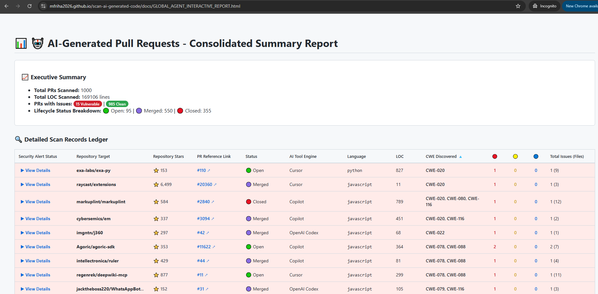
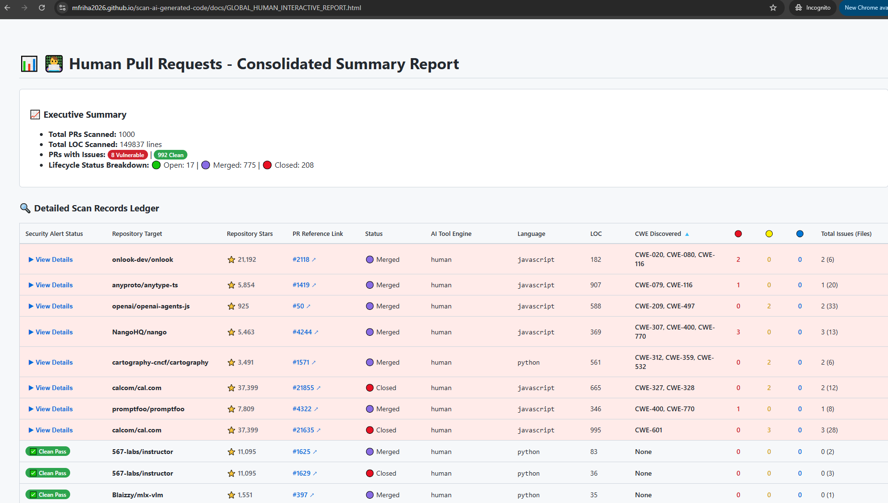
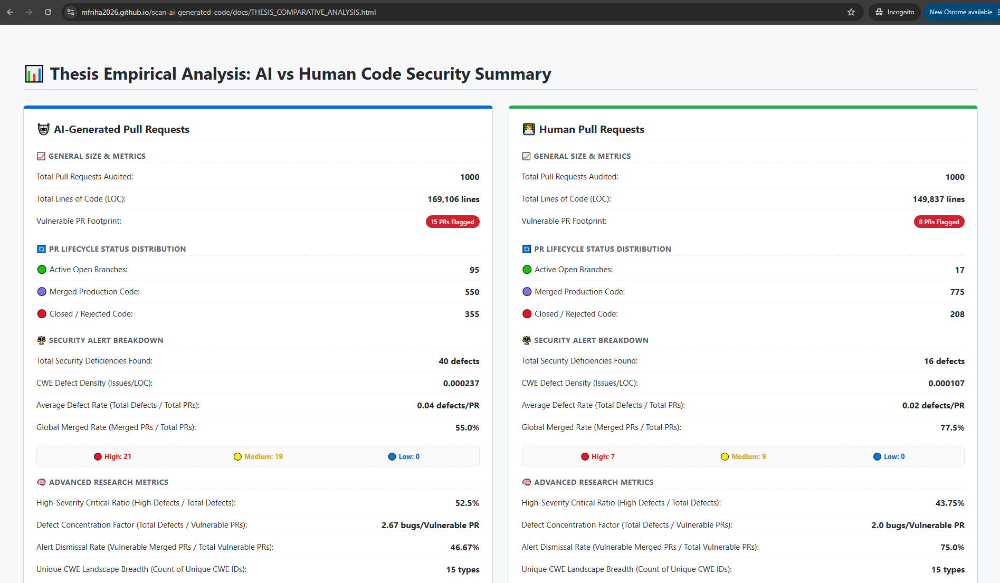

# Progress Update 9/1/2026

To evaluate the security profiles of artificial intelligence versus human developers at scale, 
the vulnerability scanning pipeline was expanded to analyze 1,000 Pull Requests (PRs) from each respective track within the AIDev dataset. 
To mitigate resource constraints and execution timeouts imposed by the GitHub Actions runner environment, a batch-processing orchestration strategy was implemented. 
The 2,000 total PRs were split into uniform batches of 250 PRs per run. Upon the completion of each operational block, 
the extracted vulnerability telemetry was compiled and incrementally appended to a centralized JSON database.

Executing the CodeQL vulnerability analysis across a dataset of 2,000 Pull Requests (divided into four uniform batches of 250 PRs per track) introduced significant computational overhead. 
The cumulative analysis required approximately 10 hours of processing time, split equally between the AI-agent and human developer cohorts. Furthermore, achieving an uninterrupted, 
deterministic execution pipeline presented substantial technical hurdles, necessitating multiple optimization iterations to refine the environment configuration and ensure robust data ingestion. 

To isolate vulnerabilities introduced exclusively by the Pull Request (PR) modifications, a precise coordinate filtering layer was implemented. This optimization filters out all static analysis defects (CWEs) residing outside the scope of the immediate patch boundaries. By focusing strictly on the code delta, this approach eliminates the need to execute dual baseline scans—first on the original repository and again post-PR—to isolate pre-existing technical debt. Consequently, the analysis considers only those vulnerabilities whose line coordinates intersect directly with the specific line additions or deletions introduced in the PR. 

  
   
  <em>Figure: Pipeline Line Differential Filtering Architecture</em>

For a comprehensive overview of the analysis architecture, the complete scanning methodology is detailed in the accompanying [Security Pipeline and Dashboard Specification](./security-pipeline-and-dashboard.md).

To facilitate real-time telemetry inspection and streamline cross-cohort evaluations, dedicated analytical dashboards were engineered to display the security outputs of each individual track side by side. Furthermore, a centralized global comparison view was developed, aggregating all foundational security metrics into a single interface to expose macro-level vulnerability trends. The entry point to these visualization panels can be accessed via the primary [Dashboard Interface Platform](https://sammy-uno.github.io/scan-ai-generated-code/).

## 📊 System Interface Visualizations

<strong>Primary Dashboard Landing Interface (index.html)</strong>

  

  <em>Figure 1: Primary entrance page interface coordinating access to full-scale pipeline telemetry.</em>

 

<strong>Cohort-Specific Analytical Panels</strong>

  
  

  <em>Figure 2: Side-by-side view of the isolated AI-Agent (left) and Human-authored (right) telemetry dashboards.</em>

 

<strong>Global Comparative Summary Panel</strong>

  

  <em>Figure 3: Consolidated dashboard interface providing macro-level cross-tabulation metrics.</em>

# Next Step

With the technical verification and dashboard implementation phase successfully completed, my immediate priority will shift entirely to writing the thesis manuscript, ensuring all empirical results are comprehensively documented and submitted within the next few weeks to meet the final submission deadline.

