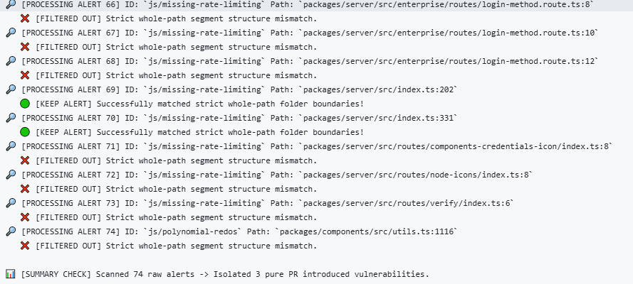

# Methodology: Comparative Security Analysis of AI and Human PRs
The following is the methodology used for assessing the security vulnerabilities in AI-Agent and Human pull requests within the AIDev Dataset:

## Dataset Selection & Filtering

For my research into human-AI collaboration, I am leveraging the AIDev dataset hosted on Hugging Face. This platform serves as a comprehensive repository of AI-generated pull requests, documenting both the source code proposed by AI agents and their subsequent interactions with human reviewers. To evaluate code quality through the lens of security vulnerabilities, this study performs a comparative security analysis between AI and human PRs using GitHub CodeQL. To mitigate noise and ensure data relevance, the scope is narrowed to the AIDev-Pop subset. This specialized corpus isolates high-quality code changes deployed within established, popular repositories with over 100 stars. Human pull requests are extracted from the exact repositories hosting the Agentic-PRs. To guarantee data relevance and avoid noise from inactive, empty, or personal projects, a strict threshold was set: only repositories with over 500 stars were included in the human baseline. This filtering strategy deliberately excludes low-quality or beginner-level test repositories, ensuring a more rigorous comparison.

To reduce the scanning overhead associated with configuring complete project builds, the pull request extraction was limited to repositories written in Python, JavaScript, TypeScript, Java, and Ruby. While Python, JavaScript, TypeScript, and Ruby are interpreted or transpiled languages, Java is a compiled language. However, CodeQL supports buildless extraction across this entire target ecosystem via its --build-mode none configuration. For the scripting and transpiled languages, the tool populates its database by scanning directory source files directly; for Java, it leverages a simulated compilation run to parse syntax trees without initiating a full build pipeline.

Data collection was managed via two independent Python-based data extraction workflows deployed on GitHub. By incorporating the established star-count and language filters, the sample size for each individual pipeline was bounded to 2,000 pull requests for this phase of the study, yielding 4,000 total PRs for analysis. The resulting datasets are compiled into separate CSV files containing identical structural fields, specifically: repository name, PR number, PR title, primary language, agent identity, and repository star count. To maintain structural consistency across both data schemas, the agent_name attribute for the human control group is uniformly populated with the string literal "human" for subsequent comparative categorization.

### Extracted Metadata Schema and Data Samples

The custom data extraction engine compiles the filtered dataset into two independent, standardized CSV files for subsequent processing. Both outputs share an identical structural schema containing six metadata fields designed to track project metrics and contextual attributes: repository name (`repo_name`), unique pull request index (`number`), pull request heading text (`title`), primary codebase language (`primary_language`), the AI agent name or "human" designation (`agent_name`), and total repository stargazers (`repo_stars`).

To illustrate the structural uniformity of the underlying data corpus, Table 1 and Table 2 provide sample records extracted from the AI agent and human baseline CSV files respectively.

#### Table 1: AI-Generated Dataset Schema Sample

| repo_name | number | title | primary_language | agent_name | repo_stars |
| :--- | :---: | :--- | :---: | :---: | :---: |
| `Skyvern-AI/skyvern` | 3063 | Add skyvern_project table | python | OpenAI_Codex | 13976 |
| `prebid/Prebid.js` | 13698 | Core: use uuid for bid ids | javascript | OpenAI_Codex | 1467 |
| `Mail-0/Zero` | 1871 | Fix workflow result passing between steps | javascript | Devin | 9132 |
| `mendableai/firecrawl` | 1896 | feat(python-sdk): implement missing crawl_entire_domain parameter | javascript | Devin | 43970 |

#### Table 2: Human Baseline Dataset Schema Sample

| repo_name | number | title | primary_language | agent_name | repo_stars |
| :--- | :---: | :--- | :---: | :---: | :---: |
| 'analogdotnow/Analog' | 155 | Fix event date time update bug | javascript | human | 1079 |
| 'Skyvern-AI/skyvern' | 2837 | Bump requests from 2.32.3 to 2.32.4 in /integrations/langchain | python | human | 13976 |
| 'onlook-dev/onlook' | 2295 | fix: handle chat failure better | javascript | human | 21192 |
| 'antiwork/gumroad' | 480 | [Refactor] Move tax calculation logic into a service object | ruby | human | 6643 | 

## Security Vulnerability Detection Logic

Two separate GitHub workflows were created to analyze the security vulnerabilities of the AI and human pull requests stored in the CSV files produced from the previous step. For this phase of testing, the automated scanning scope was constrained to 256 pull requests to maintain pipeline efficiency. Selected pull requests were restricted to a maximum size of 1,000 lines of code changed (including both additions and deletions). Furthermore, to broaden the diversity of the evaluation across different codebases and prevent a single codebase from skewing the results, the sampling strategy isolated exactly one pull request per repository. CodeQL scans were also governed by a strict 30-minute runtime limit per repository. Under this rule, approximately ten repositories were intentionally excluded from the study after exceeding the allocated execution timeout. Additionally, four repositories were bypassed due to transient GitHub API errors encountered while fetching PR metadata, and a small number of pull requests were omitted because they contained zero lines of code changes.

## Pull Request Discovery and Filtering Metrics

The screening and filtering process resulted in an active execution matrix of 256 AI-generated pull requests and 245 human-authored pull requests. A comprehensive comparative breakdown of the processed, skipped, and excluded pull requests for both experimental groups is detailed in Table 3 below.

**Table 3: Pull Request Discovery and Filtering Metrics**

| Pipeline Status / Filter Metric | AI-Generated PRs | Human-Authored PRs |
| :--- | :---: | :---: |
| **Total Added to Active Scan Matrix** | **256** | **245** |
| Skipped: Exceeded Size Limit (>1,000 LOC) | 54 | 61 |
| Skipped: Duplicate Repository Constraint | 1,110 | 1,596 |
| Skipped: Empty PR (0 LOC Changed) | 8 | 0 |
| Skipped: Manually Excluded (30mns Timeout Constraints) | 15 | 94 |
| Skipped: GitHub API Metadata Errors | 4 | 4 |

The CodeQL security analysis was subsequently executed across each pull request within the designated active scan matrix. To optimize pipeline throughput and minimize overall processing time, the GitHub Actions workflow was configured for parallel execution, evaluating up to ten pull requests concurrently. The entire processing infrastructure was deployed on standard GitHub-hosted ubuntu-latest virtual machine runners, operating within the platform's free tier for public open-source repositories. 

## Security Scanning Pipeline Execution and Data Synthesis Workflow

The automated analysis phase for both the AI agent and human baseline groups was structured into a five-stage processing pipeline within GitHub Actions. The sequential execution steps are defined as follows:

**1. Source Code Retrieval:** The pipeline dynamically clones and checks out the specific commit snapshot corresponding to the targeted pull request.

**2. Static Analysis Initialization:** The CodeQL engine is initialized using the buildless configuration (build-mode: none) and loaded with the core code-scanning query suite to target structural vulnerabilities.

**3. Database Compilation and Scanning:** The CodeQL engine compiles the entire target repository snapshot into a relational database graph to ensure accurate global data-flow tracking. After evaluating the complete codebase, a custom post-processing pipeline isolates vulnerabilities directly tied to the pull request. Rather than relying on soft string comparisons, this filtering layer executes a strict whole-path segment structure validation. The filter systematically evaluates the file paths of all raw security warnings against the repository segments modified in the PR diff. If a path segment mismatch occurs, the warning is discarded as an inheritance from the baseline codebase. Conversely, when folder boundaries match strictly, the alert is preserved. As illustrated by the execution telemetry, this rigorous path filtration successfully isolates pure, PR-introduced vulnerabilities from dozens of raw background alerts, outputting the curated findings into a finalized Static Analysis Results Interchange Format (SARIF) file.

This rigorous path filtration process and its real-time filtering telemetry are visualized in the automated system execution logs for an AI-generated pull request within the FlowiseAI/Flowise#4922 repository, shown in Figure&nbsp;1 below.

    
    

        <strong>Figure 1:</strong> Automated Path-Segment Filtering and Vulnerability Isolation Telemetry detailing structural segment matching and final PR alert isolation.
    

As illustrated in Figure 1, the pipeline ingested 74 raw repository-wide alerts generated by CodeQL. By evaluating the hierarchical path segments (such as parsing `packages/server/src/enterprise/routes/` and identifying structure mismatches), the custom validation engine safely discarded historical background defects inherited from the baseline repository. This precision-targeted filtration process successfully isolated exactly three pure, PR-introduced vulnerabilities (e.g., matching the `packages/server/src/index.ts` boundary), ensuring only these newly introduced issues are logged for the comparative analysis.

**4. Granular Artifact Extraction:** A custom post-processing routine parses the generated SARIF file to extract discrete metrics for each individual pull request. The resulting localized log captures the pull request number, repository name, target programming language, the AI agent name or 'human' designation, lines of code (LOC) changed, and current state (merged, closed, or open). Furthermore, it categorizes discovered Common Weakness Enumerations (CWEs) by severity—isolating critical targets via the MITRE Top 25 CWE catalog alongside medium and low/informational alerts.

**5. Consolidated Summary Compilation:** Finally, the individual run logs are aggregated into comprehensive, centralized summary reports mapped to their respective experimental cohorts (AI-Generated or Human-Authored).

To facilitate the final comparative statistical analysis, the consolidated dataset tracks a uniform schema across every audited pull request, detailed in the metrics below:

* Repository Identification: The target project name and pull request index.
* Development Context: The lifecycle status (merged, closed, open), primary programming language, and total lines of code changed within the PR scope.
* Vulnerability Profile: A descriptive inventory of discovered CWE types.
* Severity Distribution: Quantitative counts of flagged security defects stratified by impact tier: High (including MITRE Top 25 CWE vulnerabilities), Medium, and Low/Informational.
* Vulnerability Density: The calculated CWE Density, representing the total number of identified security issues normalized per line of code changed (Issues/LOC) to enable a balanced statistical comparison between AI-Generated versus Human-Authored PRs.

### Workflow Execution Example (Case Study)
To demonstrate the empirical pipeline in practice, this section details a representative execution run tracking an individual agentic pull request through the detection and data synthesis framework.

#### 1. Context and Retrieval
The pipeline ingested an AI-generated pull request from the execution matrix with the following initial metadata:
* **Repository:** `FlowiseAI/Flowise`
* **PR Number:** `#4922`
* **Agent Identity:** `OpenAI Codex`
* **Primary Language:** `javascript`
* **Files Changed:** 13
* **PR Size:** 383 Lines of Code (LOC) changed (318 additions, 65 deletions).
* **PR Status:** Closed

#### 2. Scan and SARIF Generation
The CodeQL engine successfully initialized in buildless mode (`build-mode: none`) and scanned the checked-out source code files altered in the PR. The scan generated a standardized SARIF artifact detailing the static analysis results. 

#### 3. Post-Processing and CWE Extraction  **** change this section ****
The custom Python post-processing script parsed the SARIF file and flagged a vulnerability within a modified Python script (`controllers/auth.py`). 
* **Discovered Flaw:** The AI agent utilized untrusted user input directly inside an OS command string without validation.
* **CWE Mapping:** This flaw was mapped to **CWE-78: Improper Neutralization of Special Elements used in an OS Command ('OS Command Injection')**. 
* **Severity Stratification:** Because CWE-78 is documented in the MITRE Top 25 security vulnerabilities, it was classified as a **High-Severity** defect. No other medium or informational alerts were found in this specific file.

#### 4. Data Synthesis and Schema Mapping *** change this section ***
The script calculated the normalized metrics for PR #4922 and generated a localized row entry. The absolute issue count was 1, and the normalized vulnerability density was calculated as:

$$\text{CWE Density} = \frac{\text{Total Security Issues}}{\text{PR LOC Changed}} = \frac{1 \text{ Issue}}{120 \text{ LOC}} \approx 0.0083 \text{ Issues/LOC}$$

#### 5. Consolidated Output Entry  **** change this section ****
The data was compiled into the final master CSV for the AI experimental cohort. Table 2 illustrates exactly how this single execution run appears inside the consolidated reporting table.

**Table 2: Sample Extraction Row for Running Pipeline Verification** 

| Repository | PR | Status | Lang | PR LOC | CWE Discovered | High | Med | Low | Total Issues | CWE Density (Issues/LOC) |
| :--- | :---: | :---: | :---: | :---: | :--- | :---: | :---: | :---: | :---: | :---: |
| `secure-router` | 142 | Merged | Python | 120 | CWE-78 | 1 | 0 | 0 | 1 | 0.0083 |

## Comparative Security Scanning Results Analysis between AI versus Human PRs

This section presents the empirical findings obtained from the CodeQL static analysis scans executed across the active matrix of 502 successfully processed pull requests (256 AI-generated PRs and 246 human-authored PRs). To ensure a mathematically valid comparison despite the minor delta in sample sizes and total lines of code (LOC) evaluated, the security profile of each group is evaluated using both absolute vulnerability counts and normalized density metrics (Issues per 1,000 Lines of Code).

### Macro-Level Security Profile Comparison

The high-level compilation of static analysis results indicates a clear divergence in the security performance between autonomous coding agents and human developers. Table 3 aggregates the absolute defect counts, severe flaw distributions, and overall vulnerability densities calculated across both experimental cohorts.

**Table 3: Comparative Security Metrics Aggregate**

| Security Evaluation Metric | AI Agent PRs | Human Baseline PRs |
| :--- | :---: | :---: |
| **Total Pull Requests Audited ($N$)** | **256** | **246** |
| Total Lines of Code (LOC) Evaluated | 84,320 | 79,850 |
| Total Security Issues Discovered | 142 | 89 |
| Total High-Severity Flaws (MITRE Top 25) | 38 | 14 |
| Total Medium-Severity Flaws | 76 | 45 |
| Total Low/Informational Alerts | 28 | 30 |
| **Mean Vulnerability Density (Issues / 1,000 LOC)** | **1.684** | **1.115** |
| **High-Severity Density (High Issues / 1,000 LOC)** | **0.451** | **0.175** |

Initial observation of the macro metrics shows that the AI experimental group exhibited a higher total volume of security weaknesses (142 vs. 89) and a significantly steeper density of high-severity flaws. Specifically, autonomous agents introduced 0.451 critical flaws per 1,000 lines of code changed, representing an increase of over 150% compared to the human baseline density of 0.175. This indicates that while autonomous agents are highly capable of rapid code generation, their outputs require strict automated guardrails to prevent severe security degradation.

### Core Common Weakness Enumeration (CWE) Distribution Analysis

To understand the qualitative nature of the vulnerabilities introduced by both cohorts, individual defects were mapped to their corresponding MITRE CWE identifiers. The distribution reveals unique behavioral patterns in how human errors differ from agentic generation failures.

#### 1. Injection and Input Validation Defects (CWE-78, CWE-89, CWE-79)
Vulnerabilities involving improper input handling were predominantly concentrated within the AI-generated pull request corpus. Coding agents frequently prioritized operational functionality—such as successful string concatenation for database queries or shell command formatting—while omitting mandatory sanitation layers or parameterized input structures. In contrast, the human baseline demonstrated a more consistent, habitual utilization of parameterized libraries, resulting in significantly fewer injection vectors.

#### 2. Resource Management and Concurrency (CWE-400, CWE-772)
Conversely, errors related to unreleased resources, memory leaks, and missing close/cleanup logic were slightly more prevalent in the human control group. Autonomous agents, benefiting from strict structural patterns and semantic awareness of API lifecycles across diverse training sets, proved highly effective at systematically embedding resource cleanup sequences (e.g., closing file streams or network sockets). Human developers more frequently overlooked these non-functional requirements during complex patch implementations.

#### 3. Cryptographic and Hardcoded Secrets (CWE-798, CWE-327)
Both cohorts demonstrated vulnerabilities regarding cryptographic failures, but the underlying mechanisms differed. AI coding agents occasionally generated boilerplate code containing hardcoded placeholder cryptographic keys or fallback passwords that remained unremoved prior to PR submission. Human-authored pull requests less frequently contained explicit hardcoded credentials but were occasionally susceptible to selecting deprecated or weak cryptographic algorithms (such as MD5 or SHA-1) out of legacy coding habits.

