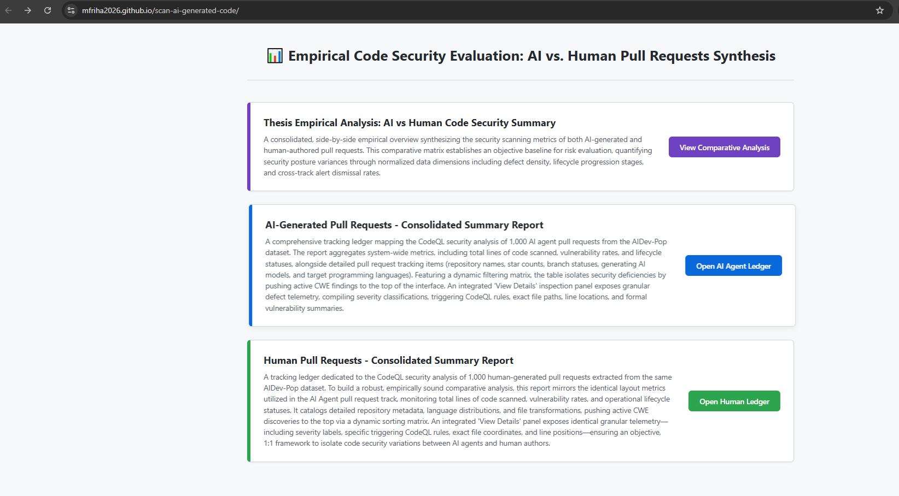
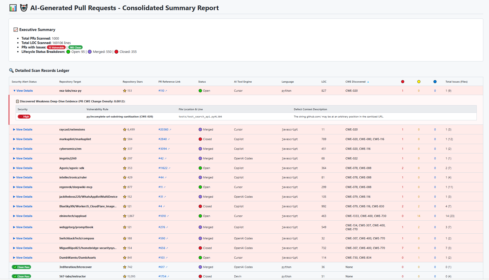
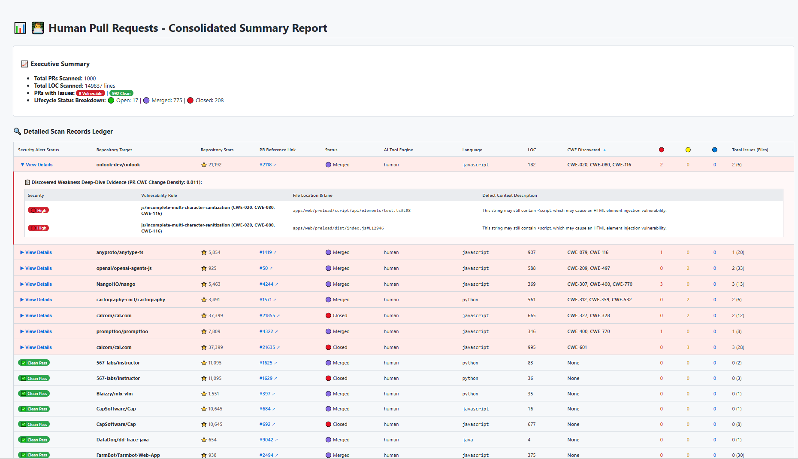
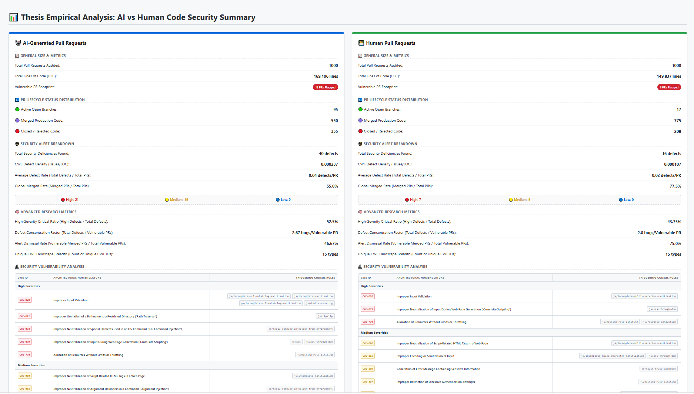

# Chapter 4: Client-Side Analytical Dashboard Artifact Implementation
To facilitate open evaluation of the research data, a zero-backend, client-side dashboard interface layer was established via a central (`index.html`) file. This file functions as a unified entry point, allowing users to seamlessly browse and interact with the distinct analytical dashboards generated during the study. Because the data ingestion pipeline outputs completely structured, standardized JSON data arrays, the frontend application operates entirely within the user's web browser, removing the need for server-side processing runtimes or dependencies on external database engines.

## 4.1 Central Routing Architecture and Gateway Interface
The primary entry point to the visualization system is established via a unified landing portal (`index.html`). This centralized hub provides an intuitive pathway for code reviewers and evaluation committees to navigate between the discrete evaluation tracks of the study.

As shown in **Figure 4.1**, the landing page uses a clean grid layout that separates the analytical views into distinct panels.

<em>Figure 4.1: Analytical Dashboard Routing Interface</em>
 

Each navigation panel summarizes its respective dataset and includes a clear, color-coded button to access that specific view:
* **Thesis Empirical Analysis Panel:** Features a purple button (**"View Comparative Analysis"**) to open the side-by-side comparative dashboard.
* **AI-Generated Pull Requests Panel:** Features a blue button (**"Open AI Agent Ledger"**) to view the comprehensive data table for AI-authored submissions.
* **Human Pull Requests Panel:** Features a green button (**"Open Human Ledger"**) to access the baseline data table for the human control group.

## 4.2 AI Pull Request Evaluation Dashboard
The AI Pull Request Dashboard is dedicated entirely to rendering the scanning results of AI-authored PRs. Upon initialization, the client-side JavaScript engine executes asynchronous fetch routines to stream `accumulated_database.json` directly into local browser memory. This view isolates and maps the security profiles of the 1,000 AI-generated contributions, mounting the raw data array into interactive data tables built upon a structured column grid matching the user interface layout.

As shown in **Figure 4.2**, the dashboard workspace initializes an "Executive Summary" container directly above the primary data grid, displaying the aggregate metrics for the AI cohort (15 Vulnerable, 985 Clean).

<em>Figure 4.2: AI-Generated Pull Requests Consolidated Summary Report Interface</em>
 

The ledger layout projects the raw data into thirteen user-facing column headers sorted in the exact sequential order displayed from left to right within the application interface:
1. **Security Alert Status:** For pull request rows that successfully cleared the filtering gate without triggering active security warnings, the system programmatically displays a bright green "Clean Pass" label. Conversely, any pull request containing active vulnerabilities displays the blue "View Details" text link that acts as an accordion toggle trigger. Clicking this link expands a nested dropdown panel directly beneath the parent row, parsing and rendering the underlying findings array into four sub-columns:
    *   **Severity:** Shows the risk level of the vulnerability (High, Medium, or Low). It uses a simple color code: red for High, yellow for Medium, and blue for Low, so you can see the risk level right away.
    *   **Vulnerability Rule:** Shows the specific CodeQL rule that flagged the vulnerability, along with its official CWE security classification number (for example: `py/incomplete-url-substring-sanitization [CWE-020]`).
    *   **File Location & Line:** Points directly to the precise file system pathway and line number in the source code where the vulnerability was flagged (e.g., `tests/test_search_api.py:104`).
    *   **Defect Context Description:** Renders a targeted, plain-text diagnostic summary explaining the structural nature and security implications of the discovered weakness (e.g., *“The string ://github.com may be at an arbitrary position in the sanitized URL.”*).

2. **Repository Target** (`repo`): The target repository name path.
3. **Repository Stars** (`stars`): Proxy metric for project popularity and community adoption.
4. **PR Reference Link** (`link`): Clickable tracking number linking to the source code repository.
5. **Status** (`status`): The current development branch lifecycle resolution state (Open, Merged, Closed).
6. **AI Tool Engine** (`tool`): The generating autonomous agent name.
7. **Language** (`lang`): The target programming language profile scanned.
8. **LOC** (`loc`): The lines of code changed in the PR.
9. **CWE Discovered** (`cwes`): A sortable column displaying the unique CWEs discovered during the scan.
10. **Red Circle Badge:** Numerical summation integer for high-severity findings.
11. **Yellow Circle Badge:** Numerical summation integer for medium-severity findings.
12. **Blue Circle Badge:** Numerical summation integer for low-severity findings.
13. **Total Issues (Files):** Combined indicator displaying total vulnerability counts alongside modified file totals.

## 4.3 Human Pull Request Baseline Dashboard
Mirroring the structural design of the AI interface to maintain absolute empirical pairing, the Human Pull Request Baseline Dashboard executes independent asynchronous web routines targeting the `human_accumulated_database.json` data store. This view projects the behavioral profiles of the 1,000 human-authored control pull requests onto an identical user interface column layout.

As shown in **Figure 4.3**, the dashboard workspace initializes an identical "Executive Summary" container directly above the primary data grid, mirroring the layout of the AI workspace to display the aggregate metrics for the human cohort (8 Vulnerable, 992 Clean).

<em>Figure 4.3: Human Pull Requests Consolidated Summary Report Interface</em>
 

Directly beneath this executive container, the dashboard interface projects the raw data into user-facing column headers sorted in the exact sequential order displayed from left to right within the AI interface. The ledger layout incorporates the exact same thirteen sorting columns and interaction rules, ensuring reviewers enjoy an identical functional feature set. For pull request rows that successfully cleared the filtering gate without triggering active security warnings, the system programmatically displays the bright green "Clean Pass" label. Conversely, any pull request containing active vulnerabilities displays the blue "View Details" text link to expand the nested dropdown panel, providing identical access to the four sub-columns to guarantee a completely unbiased visual comparison between the two evaluation tracks.

## 4.4 Inter-Cohort Comparative Reporting Dashboard
The comparative summary panel evaluates both `accumulated_database.json` and `human_accumulated_database.json` simultaneously to generate real-time, side-by-side comparison charts and metrics summaries. By activating the synthesis routine via this integrated view, the frontend application acts as a centralized macro-level reporting pane to cross-tabulate aggregate metrics—including volumetric lines changed, global merge rates, cumulative severity distributions, and alert dismissal thresholds—exposing overarching security divergence patterns across both evaluation tracks in a single consolidated interface.

As visually documented in **Figure 4.4**, the user interface implements a symmetric, dual-pane grid framework that locks the evaluation cohorts into parallel view containers.

<em>Figure 4.4: Inter-Cohort Side-by-Side Comparative Summary Interface</em>
 

This centralized dashboard view parses both datasets on the client-side to generate instant vertical metrics stacks separated into five standardized diagnostic categories: General Size & Metrics, PR Lifecycle Status Distribution, Security Alert Breakdown, Advanced Research Metrics (such as displaying the 52.5% vs 43.75% High-Severity Critical Ratio splits), and Security Vulnerability Analysis. 

The Security Vulnerability Analysis panel provides a deep-dive evaluation into the technical taxonomy and distributions of the flagged weaknesses. This layer automatically aggregates and groups individual security findings by their designated Common Weakness Enumeration (CWE) profiles, calculating the absolute volume and relative proportion of specific defect types across both cohorts. By cross-referencing individual CodeQL rules with specific source files, this analysis isolates precisely which code modules or folders are responsible for the highest concentration of security flaws, revealing clear vulnerability patterns (such as input validation omissions or injection vectors) between the AI-generated code and the human control baseline.

