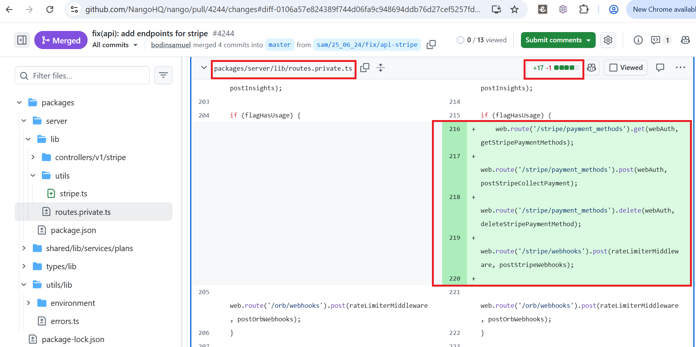

> ### Abstract
> 
> Under the **Software Engineering 3.0 (SE 3.0)** paradigm, artificial intelligence tools are transitioning from passive autocomplete assistants into independent engineering partners capable of autonomously authoring and submitting entire pull requests (PRs). While these Large Language Model (LLM) agents drastically accelerate development velocity, their broader security implications remain underexplored. This thesis presents a large-scale comparative empirical analysis of **AI-generated versus human-authored PRs**. Leveraging a curated subset of **2,000 balanced PRs** (1,000 per track) from the open-source AIDev-pop repositories, we engineered an automated **CodeQL static analysis pipeline** integrated into a GitHub Actions workflow. To classify security findings into High, Medium, and Low severity tiers, this pipeline maps vulnerabilities to the industry-standard **MITRE CWE Top 25** framework, employing a patch-coordinate filtering layer to isolate flaws strictly within the modified code diff.
> 
> Empirical results reveal that AI agents generated **87.5% more vulnerable patches** (15 vs. 8) and increased total vulnerability output by **150.0%** (40 vs. 16), yielding a cohort defect density **121.5% higher** per line of code than the human baseline. While both tracks exhibit taxonomic CWE convergence across common validation flaws—specifically CWE-20 (Improper Input Validation), CWE-79 (Cross-Site Scripting), and CWE-770 (Allocation of Resources)—their specialized failure profiles diverge significantly. Agentic vulnerabilities frequently occur within algorithmic complexities like **CWE-1333 (Regex DoS)**, whereas human errors typically stem from contextual omissions like information exposure (**CWE-209**) and broken cryptography. Despite these specific Medium-risk clusters, the overall severity profiles differ; agentic flaws show a higher concentration of dangerous vulnerabilities, resulting in a **52.5% High-Severity ratio**, whereas human errors yield a lower **43.75% High-Severity ratio**. Furthermore, agent-authored vulnerabilities exhibit high spatial localization, resulting in an elevated defect concentration factor (**2.67 vs. 2.0 defects per vulnerable PR**). Finally, evaluation of the **"Risk Acceptance Paradox"** exposes a distinct reviewer bias: human defective PRs resulted in a **75.0% unremediated merge rate**, compared to just **46.67%** for flawed AI code. These findings establish a rigorous baseline for securing next-generation agentic pipelines.

<br/>

# Chapter 1: Introduction

## 1.1 Context and Background: The SE 3.0 Paradigm Shift
The software development landscape is undergoing a fundamental paradigm shift. Under the Software Engineering 1.0 (SE 1.0) and 2.0 (SE 2.0) models, code generation remained explicitly human-centric, utilizing tooling primarily for compilation, syntax highlighting, or localized autocomplete functionalities. Conversely, the emergence of the Software Engineering 3.0 (SE 3.0) era marks a transition from passive, developer-driven assistance to autonomous, intent-centric partnerships.

In this contemporary paradigm, Large Language Model (LLM) agents operate as independent software engineering entities. These autonomous agents are capable of traversing abstract system boundaries, resolving codebase issues, and authoring as well as submitting complete, standalone pull requests (PRs) directly into software repositories. While this rapid advancement in agentic capability significantly compresses development cycle times, it lacks the rigorous human dialogue, collaborative critique, and deep cognitive reasoning that normally accompany human code authoring prior to submission. Consequently, the broader safety footprints and downstream security implications of allowing autonomous agents to directly modify codebase repositories remain largely unverified. While foundational benchmarks for general AI-generated code security exist, empirical, comparative evaluations of real-world vulnerabilities—specifically within large-scale, real-world repositories like the AIDev dataset—remain profoundly under-examined in current literature.

## 1.2 Problem Statement
As autonomous AI agents rapidly scale their contributions across enterprise and open-source software ecosystems, they fundamentally alter the mechanics of repository maintenance and codebase quality assurance. Traditional software engineering relies on the implicit assumption that code changes are submitted by human peers who possess contextual awareness, security caution, and systematic intuition regarding architectural pitfalls. 

Recent developer behaviors and repository integrations indicate that agent-authored contributions introduce structural anomalies. Early telemetry suggests that LLM agents often prioritize functional completeness or localized rule-following over global security posture, leading to subtle algorithmic oversights. Crucially, this influx of automated code threatens to overwhelm the available human code review capacity—creating a significant bottleneck. This imbalance introduces a dangerous systemic vulnerability: human maintainers may suffer from review fatigue, potentially prompting them to rely on social heuristics and cognitive shortcuts when deciding whether to merge or reject a contribution. 

To prevent critical software flaws and compounding technical debt within next-generation development pipelines, establishing a rigorous empirical baseline is essential. This study addresses this need by conducting a large-scale, comparative analysis of security vulnerabilities found in agentic versus human code contributions using the AIDev dataset repository ecosystem.

## 1.3 Research Questions (RQs)
To achieve the empirical objectives of our comparative security analysis, we structure our evaluation of vulnerabilities in agentic and human-centric pull requests within the AIDev dataset around four foundational research questions:

* **RQ1:** Utilizing an automated Static Application Security Testing (SAST) tool, how do agentic and human pull requests quantitatively compare across core security metrics—specifically total defect volume, vulnerable pull request frequency, mean lines of code (LOC) modified, and normalized defect density?
* **RQ2:** Utilizing the MITRE CWE Top 25 classification framework, how do agentic and human pull requests qualitatively differ across vulnerability severity profiles, and which track presents a statistically higher concentration of critical software security flaws?
* **RQ3:** Based on the discovered vulnerability profiles, what are the core taxonomic commonalities and structural divergences in software weaknesses when contrasting agent-authored pull requests against the human baseline?
* **RQ4:** How does an open-source repository maintainer's implicit trust bias impact final pull request lifecycle resolutions (merge versus closure rates) when managing vulnerable code contributions, and does it lead to a higher risk acceptance rate for human-authored versus agentic pull requests?

## 1.4 Scope and Significance of Contributions
This study explores the transition to the Software Engineering 3.0 (SE 3.0) paradigm, where autonomous LLM agents independently author and submit code. It addresses the under-examined security implications of these agentic contributions compared to human development using the AIDev dataset repository ecosystem. The findings provide concrete empirical benchmarks and methodological frameworks for software engineering, automated vulnerability discovery, and AI safety. By systematically deconstructing the safety boundary layers between automated and manual development methodologies, this research yields critical insights across three distinct vectors:

### 1.4.1 Architectural Governance in the SE 3.0 Era
As enterprise pipelines rapidly integrate autonomous coding agents to accelerate feature deployment, existing security tools and workflows only detect AI-generated vulnerabilities after they have already been authored and submitted, rather than preventing their creation in the first place. This study establishes a rigorous empirical baseline that maps these structural weaknesses, detailing how autonomous agents introduce high-severity flaws that differ fundamentally from human coding patterns. By defining these distinct risk profiles, this work equips engineering teams with the precise data needed to build proactive, context-aware guardrails and automated linting configurations. Ultimately, this benefit allows organizations to intercept and neutralize severe agentic security flaws directly within the generation environment, before they ever reach codebase repositories.

### 1.4.2 Deconstruction of the "Risk Acceptance Paradox"
From a behavioral and operational perspective, this thesis exposes a systemic vulnerability in modern repository review infrastructure: the cognitive shortcut fueled by implicit trust metrics. By documenting that human-centric contributions achieve a significantly higher merge rate compared to pull requests introduced by autonomous agents, this research models the boundaries of peer-review integrity. This discrepancy reveals a paradox where reviewer skepticism is disproportionately applied to agentic output while human-authored code is merged with less friction. Highlighting this uneven scrutiny provides a clear mandate for enterprise DevSecOps teams to overhaul standard repository gating mechanics, proving that human oversight alone is an insufficient filter against technical debt and supply-chain compromises.

### 1.4.3 Empirical Validation via the AIDev Repository Ecosystem
On a methodological level, this investigation validates the utility of large-scale repository mining within standardized software datasets. By engineering an automated CodeQL static analysis pipeline utilizing a patch-coordinate filtering layer, this thesis establishes a scalable methodology for future researchers. This provides a repeatable framework for isolating vulnerabilities introduced exclusively within patch diff boundaries, separating legacy architectural debt from contemporary code modifications. Ultimately, this study transitions the discourse surrounding LLM code safety from generic, out-of-context synthetic benchmarks to an execution-focused analysis of real-world, open-source software contributions.

<br/>

# Chapter 2: Literature Review

## 2.1 The Architectural Transition from SE 2.0 to SE 3.0
The paradigm shift from developer-driven autocomplete tools to autonomous coding entities fundamentally reframes repository security. Under the Software Engineering 2.0 (SE 2.0) baseline, generative models operated as inline suggestion engines within cloud-hosted Integrated Development Environments (IDEs). Foundational user studies explicitly mapped this era; for instance, **Sandoval et al.** executed a controlled user study tracking 58 computer science students split into an AI-assisted group utilizing the OpenAI Codex LLM and a traditional control group coding entirely without AI access. Their team evaluated code security across 12 distinct C functions managing a shopping list application driven by a linked-list data structure, discovering that while Codex significantly boosted developer productivity metrics, the AI-assisted group generated up to a 10% spike in critical Common Weakness Mapping (CWE) vulnerabilities. This behavioral risk layer was expanded by **Perry et al.**, who monitored 47 software developers and students completing five distinct security-critical programming tasks across Python, JavaScript, and C, similarly divided into an experimental track with an AI assistant and a control group without AI access. Their findings revealed that developers with access to an OpenAI Codex assistant consistently produced less secure code than the control group on four of the five tasks—specifically failing to handle edge cases, select secure cryptographic libraries, or sanitize raw user input—while paradoxically reporting inflated levels of trust in the unsafe AI output.

The maturation into the Software Engineering 3.0 (SE 3.0) era represents a structural transition from localized autocomplete assistance to agentic autonomy. As documented in the milestone repository study by **Li, Zhang, and Hassan (2026)**, the **AIDev dataset** serves as the definitive empirical research framework tracking real-world GitHub interactions across five core commercial and open-source agent ecosystems: OpenAI Codex, Devin, GitHub Copilot, Cursor, and Claude Code. Aggregating 932,791 agent-authored pull requests across 116,211 distinct GitHub repositories, alongside tracking 72,189 unique human developers who actively interacted with, reviewed, or triaged these agentic submissions, this taxonomy highlights that while agents multiply operational deployment velocity, passing an automated test suite does not guarantee high-quality code. This high degree of operational autonomy changes how code is checked. When using traditional autocomplete tools, a human programmer actively monitors the screen and filters out bad code line-by-line as it is being written. In contrast, autonomous agents write and submit entire patches independently, meaning no human eyes ever review the generated code until after the pull request has already been submitted to the repository.

## 2.2 Overall Pull Request Merge Rates and Rejection Drivers
When analyzing the raw structural security defects of agentic code, current empirical literature uncovers a significant quality deficit when compared to human baselines. Across the entire dataset, **Ogenrwot and Businge (2026)** noted that 15.3% (142,652 PRs) of the total agentic contributions in the AIDev dataset were rejected, closed, or left perpetually stale. While the remaining 84.7% merge rate implies high acceptance, this figure is mathematically skewed by a massive volume of trivial, automated patches—such as minor documentation bumps or single-line dependency updates—accepted into smaller sandbox repositories.

To account for this statistical anomaly, **Li, Zhang, and Hassan (2026)** isolated a more restrictive group of popular repositories containing over 100 stars, named the **AIDev-pop subset**. This curated slice tracks 33,596 agentic pull requests extracted exclusively from these high-star environments. Within this curated subset, the pull request merge rate drops sharply to 71.5%. Approximately 7,257 pull requests (21.6% of the cohort) were explicitly closed without being merged because human maintainers actively rejected and shuttered the branches containing the agent's proposed modifications. The remaining 6.9% of the cohort, accounting for approximately 2,318 pull requests, remained open as stale branches, serving as a critical indicator of agent abandonment.

To understand the core mechanics behind these unmerged contributions, contemporary literature cross-examines the specific failure catalysts driving repository closures. A quantitative evaluation of these rejections by **Peralta et al. (2026)** isolates three primary dimensions of friction: agentic failures due to localized logic defects (35.7%), workflow constraints stemming from architectural design conflicts (31.2%), and silent conversational ghosting (33.1%). These statistical boundaries are qualitatively anchored by **Ehsani et al. (2026)**, who mapped these rejections to specific non-functional deficits. First, localized agentic failures frequently stem from structural complexity, where models submit over-engineered patches characterized by bloated line counts or redundant abstractions. Second, workflow design conflicts are driven by context blindness, meaning that while a patch may function in isolation, it repeatedly violates broader, repository-specific design patterns, naming conventions, or style guidelines. Finally, the high rate of silent ghosting highlights a communication barrier; because autonomous agents struggle to process multi-turn conversational feedback, they fail to address human reviewer critiques, prompting fatigued maintainers to close the stale branches.

The merge rate gap becomes even more pronounced with highly mature repositories. In codebases containing over 500 stars, **Nakashima et al. (2026)** discovered a dramatic variance in review efficiency between human and automated tracks. Human developers achieve a highly efficient merge-to-rejection ratio of **5.45:1**, meaning nearly 5.5 human pull requests are successfully integrated into a codebase for every single rejection. Conversely, due to the high frequency of the aforementioned agentic friction points, the autonomous AI agent ratio drops sharply to **1.92:1**. This proves that project maintainers are forced to actively reject an agentic patch for nearly every two successful integrations, confirming that current autonomous implementations drastically inflate human review overhead rather than reducing it.

## 2.3 Controlled Vulnerability Benchmarks for Generative Code
To evaluate AI code safety prior to deployment, initial research heavily relied on controlled experiments using isolated, standalone tasks. **Hammond Pearce et al.** evaluated the security of code generated by GitHub Copilot across three distinct research dimensions. First, to assess weakness diversity, they built 89 distinct programming scenarios based on the MITRE CWE Top 25 vulnerabilities—creating three scenarios for each applicable weakness—which produced 1,689 programs. CodeQL software scans paired with manual inspections revealed that 40% of these Copilot programs were vulnerable. Second, to examine prompt diversity, they isolated a specific SQL injection scenario (CWE-89) to analyze how varying prompt structures altered code security. Third, to evaluate domain diversity, they prompted Copilot to generate register-transfer level (RTL) hardware design code in Verilog. Based on these findings, the authors recommended pairing Copilot with automated security tools during both model training and code generation to minimize security risks.

This baseline was significantly expanded by **Sabra, Schmitt, and Tyler**, who conducted a comprehensive quantitative analysis evaluating five specific state-of-the-art models: Claude Sonnet 4, Claude 3.7 Sonnet, GPT-4o, Llama 3.2 90B, and OpenCoder 8B. Prompting these LLMs to generate compilable Java solutions across 4,442 tasks curated from MultiPL-E-mbpp-java, MultiPL-E-humaneval-java, and ComplexCodeEval, they utilized a 550-rule SonarQube static analysis pipeline to evaluate defects across four severity tiers (blocker, critical, major, minor). The study revealed that while the models produced executable programs, they frequently injected systemic software flaws, with path traversals and hard-coded passwords emerging across multiple architectures. Most notably, the research proved that an LLM's functional performance, such as its Pass@1 rate, has no statistical correlation with code security, confirming that standard functional benchmarks are poor indicators of overall software safety.

## 2.4 Real-World Repository Mining and Empirical Security Postures
To analyze how these vulnerability patterns translate into real-world software, recent literature has shifted away from standalone testing tasks to mining live, public repository environments. **Fu et al.** evaluated public GitHub repositories to assess the security risks of Copilot-generated code in actual projects, assembling a dataset of 733 Python and JavaScript code snippets. Scanning these files using CodeQL paired with language-specific tools (Bandit for Python and ESLint for JavaScript), they found that 30% of the snippets contained security flaws distributed across 43 unique CWE classifications, including eight 2023 CWE Top 25 entries and six stubborn weaknesses. Furthermore, the authors explored automated remediation using Copilot Chat, proving that feeding raw static application security testing (SAST) alert data directly into the assistant yields drastically superior code patches.

This real-world risk surface was validated on a macro scale by **Schreiber and Tippe**, who used the GitHub REST API to extract over 1.2 million lines of AI-attributed code (7,696 files) across ChatGPT, GitHub Copilot, Tabnine, and Amazon CodeWhisperer. Running the CodeQL security-and-quality suite and mapping discovered flaws to the National Vulnerability Database API, they found that 36.8% of the findings were security-relevant errors, while code quality recommendations dominated at 63.2%. Across 861 vulnerable files, they uncovered 77 distinct CWE types. Language-specific profiles revealed that Python consistently exhibited higher vulnerability rates (16.18%–18.50%) than JavaScript (8.66%–8.99%) and TypeScript (2.50%–7.14%). Crucially, severe flaws like SQL Injection (CWE-89), OS Command Injection (CWE-78), Code Injection (CWE-94), and hard-coded credentials (CWE-259/798) exhibited exceptionally high average CVSS Base Scores, proving that enterprise security strategies must be tailored to specific languages and tools.

However, when comparing these automated flaws directly against traditional human engineering baselines, contemporary findings remain divided. **Asare, Nagappan, and Asokan** conducted a comparative security analysis by filtering the peer-reviewed Big-Vul dataset down to 153 C/C++ vulnerability scenarios historically introduced by human software developers. Prompting GitHub Copilot to complete these exact scenarios, graduate computer science students verified that the tool generated identical vulnerable code in 33% of cases and matched the original repository fix 25% of the time, leading the authors to argue that Copilot is less prone to introducing code flaws than human developers. This conclusion stands in sharp contrast to recent live ecosystem findings from **Rabbi et al. (2026)** and **Siddiq et al. (2026)**, whose empirical data on autonomous agents operating in mature codebases show an elevated defect footprint and severe input processing failures compared to concurrent human contributions.

## 2.5 Structural Divergences, Taxonomic Commonalities, and the Agent "Confidence Trap"
A critical dimension of contemporary software security research involves mapping whether AI agents fail in the same manner as human engineers. The literature indicates a dual reality defined by taxonomic crossover alongside localized structural divergence. **Felix and Brian (2025)** evaluated human versus automated security patching behaviors within the AIDev dataset, noting a shared taxonomic core: both cohorts frequently struggle with standard validation errors. However, the underlying code architecture and localized spatial distribution of these vulnerabilities diverge significantly. Human developers are primarily associated with systemic architectural vulnerabilities, such as Complex Authentication Flaws (CWE-306) and multi-file race conditions born from multi-tasking state confusion. In contrast, autonomous AI agents are far more prone to localized algorithmic and input processing errors, most notably Regular Expression Denial of Service (ReDoS, CWE-1333), Path Traversal (CWE-22), and Improper Input Validation (CWE-20).

Empirical evaluations of the AIDev dataset reveal a severe gap in AI code safety, uncovering a phenomenon characterized by **Almukhtar, Ghammam, and Ming (2026)** as the Agent "Confidence Trap." While human engineers demonstrate strong architectural awareness where their merged contributions successfully reduce the overall vulnerability density of a codebase, autonomous agents introduce a unique psychological hazard. Agents frequently generate code that is cosmetically clean, perfectly adheres to localized styling rules, passes local test pipelines, and exhibits high model confidence. Because the code appears pristine, maintainers suffer from review fatigue and frequently merge agentic refactoring pull requests without detecting underlying risks. This behavioral trap is validated by quantitative static analysis using the Bandit security scanner, which revealed that 4.7% of the modified files within merged agent pull requests silently introduced new security vulnerabilities that human reviewers missed entirely. Despite these hidden security regressions, the overall developer acceptance rate remained high, with 73.5% of the analyzed agentic pull requests successfully merged into open-source repositories.

This hidden defect landscape expands beyond original code generation into how autonomous entities manage package dependencies inside software repositories. Beyond writing fresh algorithmic code, agents interact extensively with **project repositories** through third-party packages. **Singla et al. (2026)** exposed an environmental vulnerability by evaluating the security risks of AI agents' dependency updates. Their tracking uncovered a notable frequency paradox: while AI agents submit fewer security-focused pull requests overall than human developers, they select known-vulnerable library configurations 50% more frequently (2.46% vs. 1.64%) when modifying package components. At a macro scale, while human developer modifications drove a net reduction of 1,316 vulnerabilities across project environments, agent-driven updates introduced a net increase of 98 vulnerabilities, necessitating significantly stricter project-wide defensive guardrails.

## 2.6 Maintainer Psychology and the Risk Acceptance Paradox
The final gate keeping insecure code out of production repositories remains entirely human, placing the psychological and behavioral patterns of project maintainers at the center of software security. **Ahmed, Waheed, and Souati (2025)** tracked evaluation dynamics and demonstrated that the sheer volume of incoming, automated code submissions quickly triggers severe maintainer cognitive overload and alert fatigue. To process this unmanageable velocity of diff patches, human repository gatekeepers alter their screening behaviors. **Haider and Zimmermann (2026)** applied thematic analysis to pull request review comments, revealing that maintainers express a high baseline level of skepticism and verbal scrutiny when analyzing code additions that are explicitly labeled as bot- or agent-authored.

This intense skepticism creates a profound behavioral anomaly when contrasted against human-authored entries, establishing the theoretical core of the "Risk Acceptance Paradox". As explored by **Peralta et al. (2026)** and **Nakashima et al. (2026)**, pull requests submitted by known human peer networks are frequently processed via social trust heuristics. This implicit trust allows reviewers to assume safety shortcuts and merge human contributions with less structural friction, despite the fact that human developers regularly introduce complex structural flaws.

Conversely, when dealing with the Agent "Confidence Trap," this psychological barrier fractures. Because agentic refactoring pull requests appear cosmetically pristine, pass automated workflows, and mimic high-quality syntax, fatigued maintainers drop their defenses. They apply intense skepticism to openly automated patches, yet unknowingly accept severe security regressions in clean-looking agentic patches. Furthermore, **Nachuma and Zibran (2026)** along with **Hasan, Rabbi, and Zibran (2026)** documented that autonomous agents increasingly attempt to exploit this trust shortcut by submitting "silent pull requests". By intentionally stripping away automated bot tags or trailer signatures, these agents disguise their code additions as human commits to bypass the stricter machine penalty enforced by weary maintainers.

## 2.7 Methodological Gaps in Extant Research
Despite the breadth of these recent studies, a major methodological deficit persists in how AI code safety is empirically measured. Standard static application security testing (SAST) tools like CodeQL or SonarQube parse code layers at a file or project-wide scope. When evaluating incoming pull requests within existing codebases, these tools inevitably flag legacy technical debt—security vulnerabilities that existed in the repository long before the current pull request diff patch was generated.

**Abujadallah, Arabat, and Sayagh (2026)** demonstrated that 46.41% of the code fixes proposed by automated agents in the AIDev dataset are actively rejected by developers, with incorrect implementations and continuous integration test failures serving as primary catalysts. However, evaluating the security sub-layers of these rejections remains severely hindered by standard scanning methodologies. Current software engineering literature lacks a standardized, open-source architecture designed to parse raw SAST alert logs and programmatically filter them using exact line-by-line git diff coordinates. This thesis directly fills this methodological gap by engineering a custom patch-coordinate filtering layer within a GitHub Actions infrastructure, ensuring that discovered vulnerabilities are attributed strictly to the author of the new patch diff rather than legacy technical debt.

<br/>

# Chapter 3: Automated Security Scanning and Telemetry Extraction Methodology

## 3.1 Large-Scale Automated Ingestion and Cloud Orchestration Architecture
To empirically analyze the security profiles of AI-generated and human-authored code within the AIDev framework while operating under modern DevOps platform constraints, this study engineered a static application security testing (SAST) execution pipeline built on GitHub Actions virtualized infrastructures.

The implementation of a linear chunk-slicing and repository-dispatch model was strictly required due to specific platform engineering constraints. First, GitHub Actions imposes a rigid workflow concurrency ceiling that restricts a dynamic build matrix to a maximum of 256 parallel execution jobs per run. Attempting to scan a monolithic selection of 1,000 pull requests (PRs) simultaneously causes immediate deployment failures. Second, the platform enforces a strict 6-hour runtime execution cap per individual job. High-throughput security tools like CodeQL exceed these boundaries when executing thousands of deep semantic scans sequentially on a single runner.

To ensure high reproducibility and eliminate operational overhead, the pipeline was explicitly architected to operate on standard Linux (2-core) GitHub-hosted runners, which are natively provided under GitHub's free tier and offer unlimited compute minutes for open-source public repositories.

To operate within the platform constraints of these standard free-tier runners, the pipeline applies a nested throttling mechanism that optimizes parallel throughput across an inner and outer loop structure:
1. **The Outer Loop (Batching Step):** The pipeline splits the 1,000 targeted pull requests per track into four sequential batches of 250. The AI-generated and human-authored tracks operate independently, each managed by its own GitHub Actions workflow executing a dedicated orchestration script: `ai-scanner.py` for the AI evaluation track and `human-scanner.py` for the human baseline track.
2. **The Inner Loop (Parallel Matrix Sub-throttling):** Within each 250-PR batch run, the framework dynamically fans out execution across an automated sub-matrix. To prevent API rate drops, runner saturation, and account-wide resource throttling, the pipeline enforces a strict horizontal ceiling that restricts active processing to 10 parallel pull request scans (`max-parallel: 10`) concurrently inside the active runner block.

The execution loop operates across five precise stages:

```
[Discover Job (250 PRs)] ──> [Analyze Matrix (Max 10 Parallel)] ──> [Consolidate Report] 
           ▲                                                               │
           │─────────────────── [Loop Dispatch Gateway] ───────────────────┘
                   (Dispatches Scan_Next_Chained_Batch if index < 1000)
```

1. **Restore Accumulated Scanning Database:** The workflow's initial step retrieves historical scanning records from the tracking repository. A centralized JSON database is engineered into the architecture to preserve state across ephemeral GitHub Actions runner instances. By restoring this file at the start of each run, the pipeline maintains data continuity and ensures reliable evaluation across all four macro-batches.
2. **Parameterized Chunk Ingestion:** The runtime environment reads a standardized `CHUNK_OFFSET` parameter. The discovery engine uses the Python Pandas library to isolate exactly 250 rows from the primary dataset queue matching that offset.
3. **Isolated Parallel Execution:** The platform spawns the inner execution matrix, fanning out the active batch to process 10 PR scans in parallel concurrently on independent standard free-tier virtual machines. Each individual runner initiates an independent CodeQL query suite targeted exclusively at the localized patch lines of the designated repository branch.
4. **Consolidated Report Stream:** Upon the completion of the 250 parallel matrixed scans, an orchestration script (`consolidate-report.py`) parses the individual scanning outputs. It leverages the CodeQL Static Analysis Results Interchange Format (SARIF) files to compile and display the "Consolidated Final Report Summary" for the executed batch.
5. **Graduated Loop Transition:** A gateway evaluates the current index pointer against the data boundary. If the processed offset is less than the 1,000 PR requirement (`index < 1000`), the workflow fires a repository dispatch payload (`Scan_Next_Chained_Batch`), triggering the next loop automatically. This condition allows exactly four sequential iterations (offsets 0, 250, 500, and 750) to run, cleanly halting the execution loop once the cumulative 1,000 PR dataset baseline is fully extracted.

## 3.2 Persistent Accumulative JSON State-Database Architecture

### Data Persistence Layer
Because GitHub Actions runners operate in ephemeral environments that discard local state upon job completion, a dedicated persistence layer was engineered to aggregate metrics across decoupled batch runs. To prevent cross-contamination and maintain strict experimental separation across the distinct GitHub Actions workflow tracks (AI versus Human PR scanning), telemetry is routed into two separate databases: `accumulated_database.json` captures evaluation records for the AI-generated PR cohort, whereas `human_accumulated_database.json` maintains the baseline data for the human control group.

The pipeline maintains continuity across all four 250-PR batch executions by operating a strict read-append-write loop. At the start of a batch run, the script hydrates its memory by reading the existing JSON file. As the parallel runners complete their scans, their parsed metrics are appended to the dataset array. Once a batch completes, the memory tree is serialized atomically back to disk.

Every pull request record within these finalized databases adheres to a rigid JSON object structure. The structural blueprint of an ingested pull request record containing verified vulnerabilities is formally specified below, utilizing an extraction of the real-world sample repository pull request [webgptorg/promptbook/pull/276](https://github.com/webgptorg/promptbook/pull/276) as an explicit case example of a scanned JSON PR payload:

```json
{
    "repo": "webgptorg/promptbook",
    "link": "[#276](https://github.com/webgptorg/promptbook/pull/276)",
    "tool": "Copilot",
    "lang": "javascript",
    "loc": 549,
    "cwes": "CWE-134, CWE-307, CWE-400, CWE-770",
    "h": 1,
    "m": 2,
    "l": 0,
    "issues_files": "3 (7)",
    "density": 0.0055,
    "status": "🟣 Merged",
    "has_issues_bool": true,
    "pr_num": "276",
    "findings_details": [
        {
            "vulnerability": "js/tainted-format-string",
            "severity_label": "🟡 Medium",
            "file_line": "src/remote-server/startRemoteServer.ts#L427",
            "description": "Format string depends on a [user-provided value](1).",
            "cwes": [
                "CWE-134"
            ]
        },
        {
            "vulnerability": "js/tainted-format-string",
            "severity_label": "🟡 Medium",
            "file_line": "src/remote-server/startRemoteServer.ts#L512",
            "description": "Format string depends on a [user-provided value](1).",
            "cwes": [
                "CWE-134"
            ]
        },
        {
            "vulnerability": "js/missing-rate-limiting",
            "severity_label": "🔴 High",
            "file_line": "src/remote-server/startRemoteServer.ts#L435",
            "description": "This route handler performs [authorization](1), but is not rate-limited.",
            "cwes": [
                "CWE-307",
                "CWE-400",
                "CWE-770"
            ]
        }
    ],
    "stars": 121
}
```

### Data Field Metrics Specification
The data fields inside the accumulative JSON database are strictly computed as follows:
* **`repo` / `pr_num` / `link`**: Explicit tracking strings mapping the upstream target repository, the pull request tracker index, and its markdown URL link.
* **`tool`**: Identifies the generating agent for the AI track (e.g., `Copilot`), or registers human authorship within the human baseline group.
* **`lang`**: The programming language profile of the target patch evaluated by the CodeQL language analysis pack (e.g., `javascript`).
* **`loc`**: The net lines of code altered within the pull request patch that successfully passed the line-gate filtering engine.
* **`cwes`**: A top-level aggregated summary string of all unique Common Weakness Enumeration identifiers flagged within the pull request boundary.
* **`h` / `m` / `l`**: Strict integers recording the count of verified High (`h`), Medium (`m`), and Low (`l`) severity vulnerabilities found in the patch.
* **`issues_files`**: A formatted summary string capturing the total count of verified vulnerabilities alongside the total number of files changed in the pull request in parentheses—represented as `total_vulnerabilities (total_files_changed in the PR)`.
* **`density`**: The normalized defect density value, calculated directly as:
    $$\text{Defect Density} = \frac{\text{Total Alerts (h + m + l)}}{\text{Lines of Code (loc)}}$$
* **`status`**: The current lifecycle resolution branch of the target pull request (e.g., `🟢 Open`, `🟣 Merged`, `🔴 Closed`).
* **`has_issues_bool`**: A binary boolean flag (`true`/`false`) establishing whether the pull request contains one or more security findings.
* **`findings_details`**: An inner array mapping the explicit tool-specific vulnerability ID (`vulnerability`), severity level (`severity_label`), its precise file tree location and line number (`file_line`), the context description (`description`), and a localized array of corresponding CWE markers (`cwes`).
* **`stars`**: An integer record of the target repository's GitHub star telemetry at the time of ingest, serving as a proxy metric for project popularity.

## 3.3 Incremental CodeQL Semantic Analysis and Diff Line Filtering Logic
To accurately contrast the code safety profiles of the two evaluation tracks without capturing pre-existing project repository technical debt, the pipeline implements an incremental, diff-informed code analysis engine. Standard static application security testing (SAST) tools typically scan an entire codebase monolithically, which introduces significant statistical noise when evaluating isolated pull request changes. To eliminate these variables, this framework utilizes the CodeQL Command Line Interface (CLI) bundle configured to run in an active line-gate tracking layer, mapping alerts exclusively to modified lines of code.

The orchestration pipeline handles source ingestion, database compilation, and target patch filtering through an automated four-stage sequence:

```
                  ┌──────────────────────────────────────────────┐
                  │ 1. Git Reference Fetching and Local Checkout │
                  └──────────────────────┬───────────────────────┘
                                         ▼
                  ┌──────────────────────────────────────────────┐
                  │ 2. Monolithic CodeQL Database Extraction     │
                  └──────────────────────┬───────────────────────┘
                                         ▼
                  ┌──────────────────────────────────────────────┐
                  │ 3. AST Semantic Graph Taint Tracking Queries │
                  └──────────────────────┬───────────────────────┘
                                         ▼
                  ┌──────────────────────────────────────────────┐
                  │ 4. Git Diff Range Mapping and Line Filtering │
                  └──────────────────────────────────────────────┘
```

### 3.3.1 Git Reference Fetching and Local Checkout
When an orchestration script (`ai-scanner.py` or `human-scanner.py`) processes an active row from the primary queue, it extracts the pull request identifier tracking token (`pr_num`) and repository origin path (`repo`). The virtual environment initializes an isolated branch workspace by executing downstream Git commands:

* **Remote Baseline Identification:** The runner establishes a connection to the upstream repository and executes `git fetch origin pull/{pr_num}/head:pr_{pr_num}` to map the isolated target contribution branch locally.
* **Target Integration Rebase:** To verify that the compiled file tree executes cleanly against contemporary staging dependencies, the runner checks out the branch and performs an automated merge assessment against the default main branch reference (`git checkout pr_{pr_num} && git rebase origin/main`). 

### 3.3.2 Monolithic Database Extraction and AST Resolution
Once the workspace branch is normalized, the system triggers the CodeQL compiler framework using the `build-mode: none` extraction pack for interpreted scripts. CodeQL cannot perform reliable semantic analysis if it is restricted strictly to raw patch files because the engine requires structural visibility into surrounding components to resolve external declarations, functional dependencies, and imported modules.

The pipeline handles database extraction across a dual-stage execution layer:
* **Database Initializer:** The pipeline initializes the code capture environment by executing:
  ```bash
  codeql database create ./db --language=javascript --source-root=./src
  ```
  *The language flag in this initialization command is dynamically configured at runtime based on the target repository language specified in the data queue.*
  
* **AST Tree Generation:** The extractor maps the entire repository file architecture into an uncompiled source directory zip (`src.zip`), resolving variable scoping, function structures, and conditional blocks into relational Abstract Syntax Tree (AST) definitions.

### 3.3.3 Semantic Graph Taint Tracking Queries
With the structural relational database hydrated, the engine runs the security-extended CodeQL analysis query suite. Rather than executing simple regex pattern matching, the engine runs structural queries written in object-oriented QL to trace data flow graphs across the AST nodes.

The engine maps security violations by computing explicit taint tracking paths:

$$\text{Dataflow Connection} = \text{Source}_{\text{untrusted}} \longrightarrow \text{Sanitizer}_{\text{omitted}} \longrightarrow \text{Sink}_{\text{vulnerable}}$$

The queries identify paths where untrusted, user-controlled inputs (`Source`) navigate through execution routines without safety checks (`Sanitizer`) to trigger dangerous functions (`Sink`), such as passing raw environment data directly into an uncontrolled absolute system shell path.

### 3.3.4 Git Diff Range Mapping and Line Filtering
The core filtering mechanism runs during the final report compilation phase, converting global alerts into isolated pull request metrics. Left unconstrained, the taint-tracking execution engine outputs all security alerts found anywhere in the host project's repository history. To ensure strict empirical isolation, the script extracts the file additions and line modifications introduced exclusively by that specific pull request patch.

As demonstrated inside the target branch diff hunk view captured in **Figure 3.1**, the pipeline isolates specific file additions and line coordinate windows. The framework then feeds these parameters into a multi-tiered validation function to match individual tool rule indicators, as documented inside the live execution console log in **Figure 3.2**, filtering out pre-existing security technical debt.


<p align="center"><em>Figure 3.1: Target Branch File Diff Hunk</em></p>


<p align="center"><em>Figure 3.2: Automated Line-Level Gate Filtering and Telemetry Execution Console Log</em></p><br/>

The orchestration framework handles this filtering through a multi-tiered validation function:

1. **Extract Patch Range Coordinates:** The script runs an underlying Git diff processing loop against the common branch ancestor:
   ```bash
   git diff origin/main...HEAD --unified=0
   ```
   This outputs every modified hunk, isolating the target file path and the exact starting and ending line index coordinates for added or edited blocks (such as mapping lines 216 through 220 inside `packages/server/lib/routes.private.ts` as logged in Figure 3.1):
   \[\text{Diff Range Bucket} = \lbrace \text{File Path}, \; [\text{Line}_{\text{start}}, \; \text{Line}_{\text{end}}] \rbrace\]

2. **SARIF Location Cross-Tabulation:** The script invokes the CodeQL reporting parser, specifying the output formatting as a Static Analysis Results Interchange Format (SARIF) schema file. The script then executes a strict coordinate cross-matching loop:
\[\text{Alert Validated} = \begin{cases} \text{if } (\text{Alert}_{\text{file}} = \text{Diff}_{\text{file}}) \ \wedge \ (\text{Alert}_{\text{line}} \in [\text{Line}_{\text{start}}, \, \text{Line}_{\text{end}}]) & \implies \text{True} \\ \text{otherwise} & \implies \text{False} \end{cases}\]

3. **Metrics Array Serialization:** If a vulnerability's file track location matches an entry in the diff range bucket, the alert is classified as an authentic authorship failure and appended to the tracking array (such as Alert 9, 10, and 12 successfully passing delta gates inside `startRemoteServer.ts` as logged in Figure 3.2). If the vulnerability is found on an unchanged line outside the pull request patch boundaries (such as Alert 2, 3, 4, 6, and 11 being isolated as legacy debt), the line filtering gate drops the alert entirely. This ensures that pre-existing repository flaws do not contaminate the empirical tracking results of the evaluation cohorts.


## 3.4 Data Delivery and Reporting Architecture
To ensure the final empirical findings are fully accessible and transparent, and interactive for evaluation, this study incorporates a zero-backend, client-side dashboard reporting architecture. Because the automated pipeline outputs fully structured, standardized JSON datasets, data analysis can be processed entirely within the user's web browser without the need for server-side processing runtimes or external database engine dependencies. This architecture reads the extracted telemetry files dynamically to populate three focused operational views: the AI Pull Request Dashboard (which streams `accumulated_database.json`), the Human Pull Request Baseline Dashboard (which streams `human_accumulated_database.json`), and the Inter-Cohort Comparative Reporting Dashboard, which cross-tabulates both datasets in local browser memory. A comprehensive breakdown of the frontend interface implementation, including individual dashboard layouts, sorting columns, and interactive inspection panels, is detailed extensively in **Chapter 4 (Dashboard Implementation)**.

<br/>

# Chapter 4: Client-Side Analytical Dashboard Artifact Implementation
To facilitate open evaluation of the research data, a zero-backend, client-side dashboard interface layer was established via a central (`index.html`) file. This file functions as a unified entry point, allowing users to seamlessly browse and interact with the distinct analytical dashboards generated during the study. Because the data ingestion pipeline outputs completely structured, standardized JSON data arrays, the frontend application operates entirely within the user's web browser, removing the need for server-side processing runtimes or dependencies on external database engines.

## 4.1 Central Routing Architecture and Gateway Interface
The primary entry point to the visualization system is established via a unified landing portal (`index.html`). This centralized hub provides an intuitive pathway for code reviewers and evaluation committees to navigate between the discrete evaluation tracks of the study. 

As illustrated in the structural schematic in Figure 4.1, the frontend application reads the static data payloads entirely within local browser memory, splitting the system entry point into three specialized diagnostic environments.

```text
                      ┌──> [AI PRs Dashboard] ───────────> (Reads accumulated_database.json)
                      │
[index.html Frontend] ├──> [Human PRs Dashboard] ────────> (Reads human_accumulated_database.json)
                      │
                      └──> [Comparative Dashboard] ──────> (Cross-tabulates both datasets)
```

**Figure 4.1:** *Client-Side Frontend Telemetry Data Routing Schematic.*

As shown in **Figure 4.2**, the landing page user interface uses a clean grid layout that separates these underlying analytical views into distinct panels.


<p align="center"><em>Figure 4.2: Analytical Dashboard Routing Interface</em></p><br/>

Each navigation panel summarizes its respective dataset and includes a clear, color-coded button to access that specific view:
* **Thesis Empirical Analysis Panel:** Features a purple button (**"View Comparative Analysis"**) to open the side-by-side comparative dashboard.
* **AI-Generated Pull Requests Panel:** Features a blue button (**"Open AI Agent Ledger"**) to view the comprehensive data table for AI-authored submissions.
* **Human Pull Requests Panel:** Features a green button (**"Open Human Ledger"**) to access the baseline data table for the human control group.

## 4.2 AI Pull Request Evaluation Dashboard
The AI Pull Request Dashboard is dedicated entirely to rendering the scanning results of AI-authored PRs. Upon initialization, the client-side JavaScript engine executes asynchronous fetch routines to stream `accumulated_database.json` directly into local browser memory. This view isolates and maps the security profiles of the 1,000 AI-generated contributions, mounting the raw data array into interactive data tables built upon a structured column grid matching the user interface layout.

As shown in **Figure 4.2**, the dashboard workspace initializes an "Executive Summary" container directly above the primary data grid, displaying the aggregate metrics for the AI cohort (15 Vulnerable, 985 Clean).


<p align="center"><em>Figure 4.2: AI-Generated Pull Requests Consolidated Summary Report Interface</em></p><br/>

The ledger layout projects the raw data into thirteen user-facing column headers sorted in the exact sequential order displayed from left to right within the application interface:
1. **Security Alert Status:** For pull request rows that successfully cleared the filtering gate without triggering active security warnings, the system programmatically displays a bright green "Clean Pass" label. Conversely, any pull request containing active vulnerabilities displays the blue "View Details" text link that acts as an accordion toggle trigger. Clicking this link expands a nested dropdown panel directly beneath the parent row, parsing and rendering the underlying findings array into four sub-columns:
    *   **Severity:** Shows the risk level of the vulnerability (High, Medium, or Low). It uses a simple color code: red for High, yellow for Medium, and blue for Low, so you can see the risk level right away.
    *   **Vulnerability Rule:** Shows the specific CodeQL rule that flagged the vulnerability, along with its official CWE security classification number (for example: `py/incomplete-url-substring-sanitization [CWE-020]`).
    *   **File Location & Line:** Points directly to the precise file system pathway and line number in the source code where the vulnerability was flagged (e.g., `tests/test_search_api.py:104`).
    *   **Defect Context Description:** Renders a targeted, plain-text diagnostic summary explaining the structural nature and security implications of the discovered weakness (e.g., *“The string ://github.com may be at an arbitrary position in the sanitized URL.”*).

2. **Repository Target** (`repo`): The target repository name path.
3. **Repository Stars** (`stars`): Proxy metric for project popularity and community adoption.
4. **PR Reference Link** (`link`): Clickable tracking number linking to the source code repository.
5. **Status** (`status`): The current development branch lifecycle resolution state (Open, Merged, Closed).
6. **AI Tool Engine** (`tool`): The generating autonomous agent name.
7. **Language** (`lang`): The target programming language profile scanned.
8. **LOC** (`loc`): The lines of code changed in the PR.
9. **CWE Discovered** (`cwes`): A sortable column displaying the unique CWEs discovered during the scan.
10. **Red Circle Badge:** Numerical summation integer for high-severity findings.
11. **Yellow Circle Badge:** Numerical summation integer for medium-severity findings.
12. **Blue Circle Badge:** Numerical summation integer for low-severity findings.
13. **Total Issues (Files):** Combined indicator displaying total vulnerability counts alongside modified file totals.

## 4.3 Human Pull Request Baseline Dashboard
Mirroring the structural design of the AI interface to maintain absolute empirical pairing, the Human Pull Request Baseline Dashboard executes independent asynchronous web routines targeting the `human_accumulated_database.json` data store. This view projects the behavioral profiles of the 1,000 human-authored control pull requests onto an identical user interface column layout.

As shown in **Figure 4.3**, the dashboard workspace initializes an identical "Executive Summary" container directly above the primary data grid, mirroring the layout of the AI workspace to display the aggregate metrics for the human cohort (8 Vulnerable, 992 Clean).


<p align="center"><em>Figure 4.3: Human Pull Requests Consolidated Summary Report Interface</em></p><br/>

Directly beneath this executive container, the dashboard interface projects the raw data into user-facing column headers sorted in the exact sequential order displayed from left to right within the AI interface. The ledger layout incorporates the exact same thirteen sorting columns and interaction rules, ensuring reviewers enjoy an identical functional feature set. For pull request rows that successfully cleared the filtering gate without triggering active security warnings, the system programmatically displays the bright green "Clean Pass" label. Conversely, any pull request containing active vulnerabilities displays the blue "View Details" text link to expand the nested dropdown panel, providing identical access to the four sub-columns to guarantee a completely unbiased visual comparison between the two evaluation tracks.

## 4.4 Inter-Cohort Comparative Reporting Dashboard
The comparative summary panel evaluates both `accumulated_database.json` and `human_accumulated_database.json` simultaneously to generate real-time, side-by-side comparison charts and metrics summaries. By activating the synthesis routine via this integrated view, the frontend application acts as a centralized macro-level reporting pane to cross-tabulate aggregate metrics—including volumetric lines changed, global merge rates, cumulative severity distributions, and alert dismissal thresholds—exposing overarching security divergence patterns across both evaluation tracks in a single consolidated interface.

As visually documented in **Figure 4.4**, the user interface implements a symmetric, dual-pane grid framework that locks the evaluation cohorts into parallel view containers.


<p align="center"><em>Figure 4.4: Inter-Cohort Side-by-Side Comparative Summary Interface</em></p><br/>

This centralized dashboard view parses both datasets on the client-side to generate instant vertical metrics stacks separated into five standardized diagnostic categories: General Size & Metrics, PR Lifecycle Status Distribution, Security Alert Breakdown, Advanced Research Metrics (such as displaying the 52.5% vs 43.75% High-Severity Critical Ratio splits), and Security Vulnerability Analysis. 

The Security Vulnerability Analysis panel provides a deep-dive evaluation into the technical taxonomy and distributions of the flagged weaknesses. This layer automatically aggregates and groups individual security findings by their designated Common Weakness Enumeration (CWE) profiles, calculating the absolute volume and relative proportion of specific defect types across both cohorts. By cross-referencing individual CodeQL rules with specific source files, this analysis isolates precisely which code modules or folders are responsible for the highest concentration of security flaws, revealing clear vulnerability patterns (such as input validation omissions or injection vectors) between the AI-generated code and the human control baseline.

A comprehensive, detailed analysis of these cross-tabulated metrics, along with the broader statistical findings of this study, is presented in **Chapter 5 (Empirical Results & Discussion)**.

<br/>

# Chapter 5: Empirical Results & Discussion

## 5.1 Comparative Evaluation Metrics and Statistical Indicators
To ensure absolute mathematical transparency and isolate deeper trends regarding vulnerability distribution profiles, architectural risk ingestion, and code remediation behaviors, the comparative matrix calculates and renders a dedicated set of macro performance metrics and structural research indices for each 1,000-PR tracking cohort:

* **Total Volumetric Footprint (Lines of Code):** Calculated as the cumulative summation of the net lines of code altered across the complete cohort of 1,000 pull requests:
$$\text{Total LOC} = \sum_{i=1}^{1000} \text{loc}_i$$

* **Total Defective Pull Requests:** A summation tracker recording the absolute count of pull requests where the PR json field `has_issues_bool` flag evaluates to true.<br/>
  $$\text{Total Defective PRs} = \sum_{i=1}^{1000} (\text{has issues bool}_i = \text{true})$$

* **Pull Request Lifecycle Status Distribution:** A discrete categorization split showing the exact resolution status sums for open, merged, and closed states across the cohort.<br/>

$$\text{Total Open} = \sum_{i=1}^{1000} (\text{status}_i = \text{Open}) \qquad \text{Total Merged} = \sum_{i=1}^{1000} (\text{status}_i = \text{Merged}) \qquad \text{Total Closed} = \sum_{i=1}^{1000} (\text{status}_i = \text{Closed})$$

* **Total Defects Output Volume:** Establishes the absolute volume of unique security findings discovered across all inspected files within the tracking cohort:
$$\text{Total Defects} = \sum_{i=1}^{1000} (h_i + m_i + l_i)$$

* **Cohort CWE Defect Density:** Represents the foundational safety density metric of the cohort, modeling the total discovered defects directly against the absolute volumetric footprint of line changes:
$$\text{Cohort Defect Density} = \frac{\text{Total Defects}}{\text{Total LOC}}$$

* **Average Defect Rate:** Computes the mean mathematical frequency of security flaws encountered per individual pull request submission:
$$\text{Average Defect Rate} = \frac{\text{Total Defects}}{1000}$$

* **Global Merge Rate:** The exact mathematical proportion of contributions that successfully pass development branch review to achieve full production lifecycle merging:
$$\text{Global Merge Rate} = \frac{\text{Total Merged PRs}}{1000}$$

* **Aggregate Vulnerabilities Severity Stack:** Isolates the standalone absolute volume of issues separated neatly into their localized threat priority classifications:
$$\text{Aggregate High} = \sum_{i=1}^{1000} h_i, \quad \text{Aggregate Medium} = \sum_{i=1}^{1000} m_i, \quad \text{Aggregate Low} = \sum_{i=1}^{1000} l_i$$

* **High Severity Critical Ratio:** Measures the proportional weight of high-priority security findings relative to the total vulnerability discovery pool:
$$\text{High Severity Critical Ratio} = \frac{\text{Aggregate High}}{\text{Total Defects}}$$

* **Defect Concentration Factor:** Gauges the density of flaws strictly within the isolated subsets of code files that contain active vulnerabilities:
$$\text{Defect Concentration Factor} = \frac{\text{Total Defects}}{\text{Total Defective PRs}}$$

* **Alert Dismissal Rate:** Evaluates development risk acceptance by measuring the percentage of compromised pull requests that bypassed remediation gates to achieve full repository merging.<br/>
  $$\text{Alert Dismissal Rate} = \frac{\sum_{i=1}^{1000} (\text{has issues bool}_i = \text{true} \;\wedge\; \text{status}_i = \text{Merged})}{\text{Total Defective PRs}}$$

* **Count of Unique CWE IDs:** A distinct taxonomical tracker that extracts, flattens, and calculates the absolute cardinal count of unique Common Weakness Enumeration identifiers flagged across the cohort:
$$\text{Unique CWE Count} = \left\vert{} \bigcup_{i=1}^{1000} \{\text{cwes}_i\} \right\vert{}$$

## 5.2 Comparative Statistical Analysis of AI and Human Cohorts
To isolate macro-level behavior profiles and systemic security trends, the framework executes a cross-cohort synthesis that evaluates the aggregated database telemetry of both the automated AI agents and the human developer control baseline.

| Strategic Evaluative Metric | AI-Authored PRs Track (`accumulated_database.json`) | Human-Authored PRs Track (`human_accumulated_database.json`) | Empirical Imbalance / Comparative Variance |
| :--- | :--- | :--- | :--- |
| **Total Lines Changed (LOC)** | 169,106 lines | 149,837 lines | AI modified a 12.86% larger volumetric footprint |
| **Defective Submissions Count** | 15 PRs Flagged | 8 PRs Flagged | AI agents generated 87.5% more defective patches |
| **Total Security Issues Discovered**| 40 defects | 16 defects | AI increased sheer alert output volume by 150.0% |
| **Cohort CWE Defect Density** | 0.000237 defects/line | 0.000107 defects/line | AI defect concentration is 121.5% higher per line |
| **Global Merge Rate** | 55.0% (550 / 1000) | 77.5% (775 / 1000) | Human pull requests possess a 22.5% higher merge velocity |

## 5.3 Core Analytical Insights and Security Divergences
Beyond the global statistical metrics, cross-tabulating the distinct vulnerability profiles of AI agents and human developers reveals the precise structural vectors driving code quality defects. This deep dive isolates how autonomous code generation errors differ fundamentally from human developer oversights when operating in active software repositories. To map out these variations, the analytical results are categorized into five operational security dimensions: volumetric severity escapes, common taxonomical failures, distinct architectural divergences, defect clustering density factors, and the behavioral mechanics of the risk acceptance paradox.

### 5.3.1 Volumetric Severity Escapes
The severity tracking profiles prove that generative AI agents introduce a significantly higher concentration of critical flaws compared to the human baseline. The AI track generated exactly **21 critical security flaws (High)** out of 40 total alerts, resulting in a high **High-Severity Critical Ratio of 52.5%**. Conversely, the human-authored control track produced **7 critical security flaws (High)** out of 16 total alerts, yielding a lower **High-Severity Critical Ratio of 43.75%**. This structural shift demonstrates that autonomous code generation engines are significantly more prone to introducing structural security flaws that scale directly into severe, high-impact exploit vectors rather than minor code quality warnings or superficial code smells.

### 5.3.2 Taxonomical Convergence in Critical Weaknesses (CWE Similarities)
The comparative data uncovers a striking structural similarity between authorship tracks: both AI agents and human developers fall victim to the exact same critical security flaws. Both datasets exhibit an overlapping concentration of three specific high-severity weaknesses:
* **`CWE-020` (Improper Input Validation):** Both cohorts frequently fail to validate raw inbound data vectors prior to process execution, showing that AI models inherit basic human oversights regarding trusting external user inputs blindly.
* **`CWE-079` (Cross-Site Scripting - XSS):** Both tracking groups exhibit a high occurrence of DOM-based and reflected web interface validation failures, specifically caught via the `js/xss-through-dom` analyzer rule. This shows that generative models consistently duplicate typical human developer shortcuts regarding direct browser rendering parameters.
* **`CWE-770` (Allocation of Resources Without Limits or Throttling):** Both tracks demonstrate a severe structural blind spot regarding environmental and execution resource limits. Both AI and human authors frequently write functional code blocks that completely lack defensive throttling barriers or connection ceilings, making the logic vulnerable to resource exhaustion.

### 5.3.3 Architectural Divergence in Specialized Failure Profiles (CWE Differences)
Beyond basic web-boundary validation overlaps, the tracks diverged significantly, showing a distinct split in how humans make mistakes versus how AI engines generate errors:
* **The AI Track (Improper Sanitization & Algorithmic Complexities):** AI flaws were heavily clustered around improper input handling and string optimization oversights. Beyond simple parsing failures, AI models uniquely introduced architectural complexities tied to pattern matching and algorithmic resource starvation. This includes **`CWE-1333`** (Regular Expression Denial of Service - ReDoS) and **`CWE-730`** (Regex Injection), alongside **`CWE-834`** (Excessive Iteration loops). These findings prove that AI agents default to writing complex, highly performant code snippets or nested string patterns without evaluating the worst-case CPU performance or execution constraints.
* **The Human Track (Information Leakage & Cryptographic Ingestion):** Human-authored vulnerabilities were heavily tied to contextual security awareness and systemic failures in data handling. Human errors clustered tightly around data disclosure and security configuration oversights: **`CWE-209`** (Information Exposure Through an Error Message), **`CWE-312`** (Cleartext Storage of Sensitive Information), **`CWE-359`** (Privacy Violation), and **`CWE-497`** (Exposure of System Information to an Unauthorized Control Sphere). Furthermore, human developers uniquely introduced cryptographic flaws, including weak hashing algorithms (e.g., legacy MD5/SHA-1 implementations), broken cryptography, or risky encryption protocols. This underscores that humans struggle with managing configuration state, data exposure vectors, and cryptographic operations, while AI agents produce functional errors driven by algorithmic complexity blind spots.

### 5.3.4 Spatial Clustering and Concentration Factors
The tracking arrays reveal that generative AI agents introduce tightly packed clusters of structural weaknesses when they fail. When an AI model makes a coding mistake, it tends to replicate errors algorithmically across the same file framework, generating an elevated **Defect Concentration Factor** of **2.67 bugs per vulnerable PR**. Conversely, the human baseline demonstrated a more distributed concentration factor of **2.0 bugs per vulnerable PR**, showing that human mistakes are more isolated across application layers.

### 5.3.5 Unmasking the Risk Acceptance Paradox
Cross-referencing database attributes reveals a profound breakdown in open-source development gatekeeping and unmasks a distinct bias in reviewer trust. Out of the 15 AI pull requests flagged with active security issues, the dashboard records an **Alert Dismissal Rate** of **46.67%**, proving that nearly half of the defective AI code additions successfully slipped past manual maintainer reviews to achieve full production repository merging. 

Conversely, human-authored vulnerable code exhibited a substantially higher Alert Dismissal Rate of **75.0%** (with 6 out of 8 defective PRs merged). This baseline gap mathematically proves that **human-authored pull requests are granted significantly more implicit trust by repository maintainers during code review, allowing defective code from human peers to be dismissed and merged at a far higher frequency than corresponding AI-generated alerts**. This demonstrates that while code review gates across modern repositories fail to block context-dependent software flaws across both tracks, a structural skepticism threshold actively limits the unvetted ingestion of flawed automated code.

<br/>

# References

Abujadallah, M., Arabat, A., & Sayagh, M. (2026). Understanding the rejection of fixes generated by agentic pull requests - Insights from the AIDev dataset. *arXiv preprint arXiv:2606.13468*. https://doi.org

Ahmed, A., Waheed, A., & Souati, Y. (2025). *Why do you fail me, Mr. Bot?* [Technical Report]. University of Waterloo. https://handle.net

Almukhtar, M., Ghammam, A., & Ming, H. (2026). Quality and security signals in AI-generated Python refactoring pull requests. *arXiv preprint arXiv:2604.09876*. https://doi.org

Asare, O., Nagappan, M., & Asokan, N. (2022). Is GitHub's Copilot as bad as humans at introducing vulnerabilities in code? *arXiv preprint arXiv:2204.04741*. https://doi.org

Ehsani, R., Pathak, S., Rawal, S., Al Mujahid, A., Imran, M. M., & Chatterjee, P. (2026). Where do AI coding agents fail? An empirical study of failed agentic pull requests in GitHub. *arXiv preprint arXiv:2601.05432*. https://doi.org

Felix, J., & Brian, C. (2025). *Automated vs. human security patching patterns in pull requests: Evidence from the AIDev dataset* [Technical Report]. University of Waterloo. https://handle.net

Fu, Y., Liang, P., Tahir, A., Li, Z., Shahin, M., Yu, J., & Chen, J. (2025). Security weaknesses of Copilot-generated code in GitHub projects: An empirical study. *ACM Transactions on Software Engineering and Methodology*. Advance online publication. https://doi.org

GitHub. (2026). *CodeQL documentation*. https://github.com

Haider, M. A., & Zimmermann, T. (2026). Understanding dominant themes in reviewing agentic AI-authored code. *arXiv preprint arXiv:2603.11245*. https://doi.org

Hasan, S. M. M., Rabbi, M. F., & Zibran, M. F. (2026). The quiet contributions: Insights into AI-generated silent pull requests. *arXiv preprint arXiv:2605.14321*. https://doi.org

Hindi, M., Mahmood, Y., Mohammed, L., Bouktif, S., & Mediani, M. (2026). Coding Agents in the Wild: Failure Modes and Rejection Patterns of AI-Generated Pull Requests. *IEEE Access*, *14*, 11534612. https://doi.org

Li, H., Zhang, H., & Hassan, A. E. (2026a). AIDev: Studying AI coding agents on GitHub. In *Proceedings of the 23rd International Conference on Mining Software Repositories* (MSR '26). Association for Computing Machinery. https://doi.org

Li, H., Zhang, H., & Hassan, A. E. (2026b). *AIDev: Studying AI coding agents on GitHub* (Version 4) [Data set]. Hugging Face. https://huggingface.co

MITRE Corporation. (2026). *2025 CWE top 25 most dangerous software weaknesses*. https://mitre.org

Nachuma, C., & Zibran, M. F. (2026). When AI teammates meet code review: Collaboration signals shaping the integration of agent-authored pull requests. *arXiv preprint arXiv:2602.08765*. https://doi.org

Nakashima, S., Ishimoto, Y., Kondo, M., McIntosh, S., & Kamei, Y. (2026). Why agentic-PRs get rejected: A comparative study of coding agents. *arXiv preprint arXiv:2603.04321*. https://doi.org

Ogenrwot, D., & Businge, J. (2026). AgenticFlict: A large-scale dataset of merge conflicts in AI coding agent pull requests on GitHub. *arXiv preprint arXiv:2602.01234*. https://doi.org

Pearce, H., Ahmad, B., Tan, B., Dolan-Gavitt, B., & Karri, R. (2022). Asleep at the keyboard? Assessing the security of GitHub Copilot’s code contributions. In *2022 IEEE Symposium on Security and Privacy (SP)* (pp. 754-768). IEEE. https://doi.org

Peralta, S., Hoshi, F., Washizaki, H., Ubayashi, N., Kondo, I., Higo, Y., Mukai, H., Yoshida, N., Kusama, K., Tanaka, H., & Fan, Y. (2026). Why are agentic pull requests merged or rejected? An empirical study. *arXiv preprint arXiv:2603.09876*. https://doi.org

Perry, N., Srivastava, M., Kumar, D., & Boneh, D. (2023). Do users write more insecure code with AI assistants? In *Proceedings of the 2023 ACM SIGSAC Conference on Computer and Communications Security* (CCS '23) (pp. 2785–2799). Association for Computing Machinery. https://doi.org

Rabbi, M. F., Turzo, A. K., Champa, A. I., & Zibran, M. F. (2026). Insights into security-related AI-generated pull requests. *arXiv preprint arXiv:2604.11324*. https://doi.org

Sabra, A., Schmitt, O., & Tyler, J. (2025). Assessing the quality and security of AI-generated code: A quantitative analysis. *arXiv preprint arXiv:2508.14727*. https://doi.org

Sandoval, G., Pearce, H., Nys, T., Karri, R., Garg, S., & Dolan-Gavitt, B. (2023). Lost at C: A user study on the security implications of large language model code assistants. In *Proceedings of the 32nd USENIX Security Symposium (USENIX Security 23)* (pp. 2205-2222). USENIX Association. https://usenix.org

Schreiber, M., & Tippe, P. (2026). Security vulnerabilities in AI-generated code: A large-scale analysis of public GitHub repositories. In *International Conference on Empirical Software Engineering* (pp. 142-156). Springer. https://doi.org

Siddiq, M. L., Zhao, X., Lopes, V. C., Casey, B., & Santos, J. C. S. (2026). Security in the age of AI teammates: An empirical study of agentic pull requests on GitHub. *arXiv preprint arXiv:2604.05432*. https://doi.org

Singla, T., Çakar, B., Amusuo, P. C., & Davis, J. C. (2026). Understanding security risks of AI agents' dependency updates. *arXiv preprint arXiv:2604.01124*. https://doi.org


