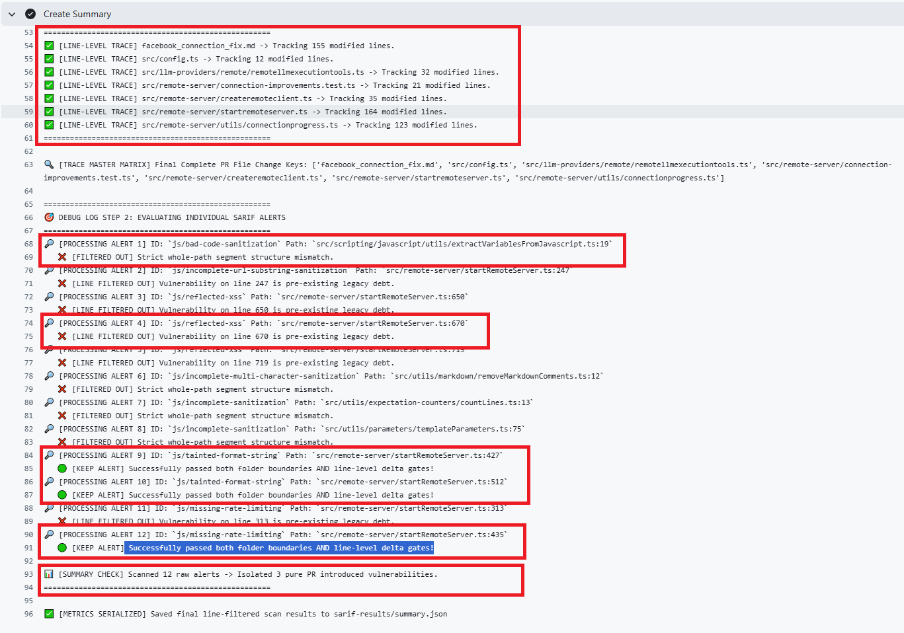

# 2.0 Automated Security Scanning and Telemetry Extraction Methodology

## 2.1 Large-Scale Automated Ingestion and Execution Framework

To empirically analyze the security profiles of AI-generated and human-authored code snippets within the AIDev framework, this study engineered a static application security testing (SAST) execution pipeline built on GitHub Actions.

The implementation of a linear chunk-slicing and repository-dispatch model was strictly required due to specific platform engineering constraints. First, GitHub Actions imposes a rigid workflow concurrency ceiling that restricts a dynamic build matrix to a maximum of 256 parallel execution jobs per run. Attempting to scan a monolithic selection of 1,000 pull requests (PRs) simultaneously causes immediate deployment failures. Second, the platform enforces a strict 6-hour runtime execution cap per individual job. High-throughput security tools like CodeQL exceed these boundaries when executing thousands of deep semantic scans sequentially on a single runner.

To ensure high reproducibility and eliminate operational overhead, the pipeline was explicitly architected to operate on standard Linux (2-core) GitHub-hosted runners, which are natively provided under GitHub's free tier and offer unlimited compute minutes for open-source public repositories.

To operate within the platform constraints of these standard free-tier runners, the pipeline applies a nested throttling mechanism that optimizes parallel throughput across an inner and outer loop structure:

1. **The Outer Loop (Batching Step):** The pipeline splits the 1,000 targeted pull requests per track into four sequential batches of 250. The AI-generated and human-authored tracks operate independently, each managed by its own GitHub Actions workflow executing a dedicated orchestration script: `ai-scanner.py` for the AI evaluation track and `human-scanner.py` for the human baseline track.
2. **The Inner Loop (Parallel Matrix Sub-throttling):** Within each 250-PR batch run, the framework dynamically fans out execution across an automated sub-matrix. To prevent API rate drops, runner saturation, and account-wide resource throttling, the pipeline enforces a strict horizontal ceiling that restricts active processing to 10 parallel pull request scans (`max-parallel: 10`) concurrently inside the active runner block.

The execution loop operates across five precise stages:

```
[Discover Job (250 PRs)] ──> [Analyze Matrix (Max 10 Parallel)] ──> [Consolidate Report] 
           ▲                                                               │
           │─────────────────── [Loop Dispatch Gateway] ───────────────────┘
                   (Dispatches Scan_Next_Chained_Batch if index < 1000)
```

1. **Restore Accumulated Scanning Database:** The workflow initial step retrieves the historical scanning records from the tracking repository. A centralized JSON database is engineered into the architecture to preserve state across ephemeral GitHub Actions runner instances. By restoring this file at the start of each run, the pipeline maintains data continuity and ensures reliable evaluation across all four macro-batches.
2. **Parameterized Chunk Ingestion:** The runtime environment reads a standardized `CHUNK_OFFSET` parameter. The discovery engine uses the Python Pandas library to isolate exactly 250 rows from the primary dataset queue matching that offset.
3. **Isolated Parallel Execution:** The platform spawns the inner execution matrix, fanning out the active batch to process 10 PR scans in parallel concurrently on independent standard free-tier virtual machines. Each individual runner initiates an independent CodeQL query suite targeted exclusively at the localized patch lines of the designated repository branch.
4. **Consolidated Report Stream:** Upon the completion of the 250 parallel matrixed scans, an orchestration script (`consolidate-report.py`) parses the individual scanning outputs. It leverages the CodeQL Static Analysis Results Interchange Format (SARIF) files to compile and display the "Consolidated Final Report Summary" for the executed batch.
5. **Graduated Loop Transition:** A gateway evaluates the current index pointer against the data boundary. If the processed offset is less than the 1,000 PR requirement (`index < 1000`), the workflow fires a repository dispatch payload (`Scan_Next_Chained_Batch`), triggering the next loop automatically. This condition allows exactly four sequential iterations (offsets 0, 250, 500, and 750) to run, cleanly halting the execution loop once the cumulative 1,000 PR dataset baseline is fully extracted.


## 2.2 Persistent Accumulative JSON State-Database Architecture

### Data Persistence Layer
Because GitHub Actions runners operate in ephemeral environments that discard local state upon job completion, a dedicated persistence layer was engineered to aggregate metrics across decoupled batch runs. To prevent cross-contamination and maintain strict experimental separation across the distinct GitHub Actions workflow tracks (AI versus Human PR scanning), telemetry is routed into two separate databases: `accumulated_database.json` captures evaluation records for the AI-generated PR cohort, whereas `human_accumulated_database.json` maintains the baseline data for the human control group.

The pipeline maintains continuity across all four 250-PR batch executions by operating a strict read-append-write loop. At the start of a batch run, the script hydrates its memory by reading the existing JSON file. As the parallel runners complete their scans, their parsed metrics are appended to the dataset array. Once a batch completes, the memory tree is serialized atomically back to disk.

Every pull request record within these finalized databases adheres to a rigid JSON object structure. The structural blueprint of an ingested pull request record containing verified vulnerabilities is formally specified below, utilizing an extraction of the real-world sample repository pull request [webgptorg/promptbook/pull/276](https://github.com/webgptorg/promptbook/pull/276) as an explicit case example of a scanned JSON PR payload:

```json
{
    "repo": "webgptorg/promptbook",
    "link": "[#276](https://github.com/webgptorg/promptbook/pull/276)",
    "tool": "Copilot",
    "lang": "javascript",
    "loc": 549,
    "cwes": "CWE-134, CWE-307, CWE-400, CWE-770",
    "h": 1,
    "m": 2,
    "l": 0,
    "issues_files": "3 (7)",
    "density": 0.0055,
    "status": "🟣 Merged",
    "has_issues_bool": true,
    "pr_num": "276",
    "findings_details": [
        {
            "vulnerability": "js/tainted-format-string",
            "severity_label": "🟡 Medium",
            "file_line": "src/remote-server/startRemoteServer.ts#L427",
            "description": "Format string depends on a [user-provided value](1).",
            "cwes": [
                "CWE-134"
            ]
        },
        {
            "vulnerability": "js/tainted-format-string",
            "severity_label": "🟡 Medium",
            "file_line": "src/remote-server/startRemoteServer.ts#L512",
            "description": "Format string depends on a [user-provided value](1).",
            "cwes": [
                "CWE-134"
            ]
        },
        {
            "vulnerability": "js/missing-rate-limiting",
            "severity_label": "🔴 High",
            "file_line": "src/remote-server/startRemoteServer.ts#L435",
            "description": "This route handler performs [authorization](1), but is not rate-limited.",
            "cwes": [
                "CWE-307",
                "CWE-400",
                "CWE-770"
            ]
        }
    ],
    "stars": 121
}
```

### Data Field Metrics Specification
The data fields inside the accumulative JSON database are strictly computed as follows:

*   **`repo` / `pr_num` / `link`**: Explicit tracking strings mapping the upstream target repository, the pull request tracker index, and its markdown URL link.
*   **`tool`**: Identifies the generating agent for the AI track (e.g., `Copilot`), or registers human authorship within the human baseline group.
*   **`lang`**: The programming language profile of the target patch evaluated by the CodeQL language analysis pack (e.g., `javascript`).
*   **`loc`**: The net lines of code altered within the pull request patch that successfully passed the line-gate filtering engine.
*   **`cwes`**: A top-level aggregated summary string of all unique Common Weakness Enumeration identifiers flagged within the pull request boundary.
*   **`h` / `m` / `l`**: Strict integers recording the count of verified High (`h`), Medium (`m`), and Low (`l`) severity vulnerabilities found in the patch.
*   **`issues_files`**: A formatted summary string capturing the total count of verified vulnerabilities alongside the total number of files changed in the pull request in parentheses—represented as `total_vulnerabilities (total_files_changed in the PR)`.
*   **`density`**: The normalized defect density value, calculated directly as:
    $$\text{Defect Density} = \frac{\text{Total Alerts (h + m + l)}}{\text{Lines of Code (loc)}}$$
*   **`status`**: The current lifecycle resolution branch of the target pull request (e.g., `🟢 Open`, `🟣 Merged`, `🔴 Closed`).
*   **`has_issues_bool`**: A binary boolean flag (`true`/`false`) establishing whether the pull request contains one or more security findings.
*   **`findings_details`**: An inner array mapping the explicit tool-specific vulnerability ID (`vulnerability`), severity level (`severity_label`), its precise file tree location and line number (`file_line`), the context description (`description`), and a localized array of corresponding CWE markers (`cwes`).
*   **`stars`**: An integer record of the target repository's GitHub star telemetry at the time of ingest, serving as a proxy metric for project popularity.


## 2.3 Incremental CodeQL Semantic Analysis and Diff Line Filtering Logic

To accurately contrast the code safety profiles of the two evaluation tracks without capturing pre-existing project repository technical debt, the pipeline implements an incremental, diff-informed code analysis engine. Standard static application security testing (SAST) tools typically scan an entire codebase monolithically, which introduces significant statistical noise when evaluating isolated pull request changes. To eliminate these variables, this framework utilizes the CodeQL Command Line Interface (CLI) bundle configured to run in an active line-gate tracking layer, mapping alerts exclusively to modified lines of code.

The orchestration pipeline handles source ingestion, database compilation, and target patch filtering through an automated four-stage sequence:

```
                  ┌──────────────────────────────────────────────┐
                  │ 1. Git Reference Fetching and Local Checkout │
                  └──────────────────────┬───────────────────────┘
                                         ▼
                  ┌──────────────────────────────────────────────┐
                  │ 2. Monolithic CodeQL Database Extraction     │
                  └──────────────────────┬───────────────────────┘
                                         ▼
                  ┌──────────────────────────────────────────────┐
                  │ 3. AST Semantic Graph Taint Tracking Queries │
                  └──────────────────────┬───────────────────────┘
                                         ▼
                  ┌──────────────────────────────────────────────┐
                  │ 4. Git Diff Range Mapping and Line Filtering │
                  └──────────────────────────────────────────────┘
```

### 2.3.1 Git Reference Fetching and Local Checkout
When an orchestration script (`ai-scanner.py` or `human-scanner.py`) processes an active row from the primary queue, it extracts the pull request identifier tracking token (`pr_num`) and repository origin path (`repo`). The virtual environment initializes an isolated branch workspace by executing downstream Git commands:
1.  **Remote Baseline Identification:** The runner establishes a connection to the upstream repository and executes `git fetch origin pull/{pr_num}/head:pr_{pr_num}` to map the isolated target contribution branch locally.
2.  **Target Integration Rebase:** To verify that the compiled file tree executes cleanly against contemporary staging dependencies, the runner checks out the branch and performs an automated merge assessment against the default main branch reference (`git checkout pr_{pr_num} && git rebase origin/main`).

### 2.3.2 Monolithic Database Extraction and AST Resolution
Once the workspace branch is normalized, the system triggers the CodeQL compiler framework using the `build-mode: none` extraction pack for interpreted scripts. CodeQL cannot perform reliable semantic analysis if it is restricted strictly to raw patch files because the engine requires structural visibility into surrounding components to resolve external declarations, functional dependencies, and imported modules.

The pipeline handles database extraction across a dual-stage execution layer:
*   **Database Initializer:** The pipeline initializes the code capture environment by executing:
    ```bash
    codeql database create ./db --language=javascript --source-root=./src
    ```
*   **AST Tree Generation:** The extractor maps the entire repository file architecture into an uncompiled source directory zip (`src.zip`), resolving variable scoping, function structures, and conditional blocks into relational Abstract Syntax Tree (AST) definitions.

### 2.3.3 Semantic Graph Taint Tracking Queries
With the structural relational database hydrated, the engine runs the security-extended CodeQL analysis query suite. Rather than executing simple regex pattern matching, the engine runs structural queries written in object-oriented QL to trace data flow graphs across the AST nodes.

The engine maps security violations by computing explicit taint tracking paths:

$$\text{Dataflow Connection} = \text{Source}_{\text{untrusted}} \longrightarrow \text{Sanitizer}_{\text{omitted}} \longrightarrow \text{Sink}_{\text{vulnerable}}$$


The queries identify paths where untrusted, user-controlled inputs (`Source`) navigate through execution routines without safety checks (`Sanitizer`) to trigger dangerous functions (`Sink`), such as passing raw environment data directly into an uncontrolled absolute system shell path.

### 2.3.4 Git Diff Range Mapping and Line Filtering
The core filtering mechanism runs during the final report compilation phase, converting global alerts into isolated pull request metrics. Left unconstrained, the taint-tracking execution engine outputs all security alerts found anywhere in the host project's repository history. To ensure strict empirical isolation, the script extracts the file additions and line modifications introduced exclusively by that specific pull request patch.

As demonstrated inside the real-world operational execution environment log captured in Figure 2.1, the framework actively traces independent SARIF rule indicators, validating raw alerts and cross-referencing lines to classify or discard vulnerabilities based on localized delta parameters:


<p align="center"><em>Figure 2.1: Automated Line-Level Gate Filtering and Telemetry Execution Console Log</em></p><br/>

The orchestration framework handles this filtering through a multi-tiered validation function:

1. **Extract Patch Range Coordinates:** The script runs an underlying Git diff processing loop against the common branch ancestor:
   ```bash
   git diff origin/main...HEAD --unified=0
   ```
   This outputs every modified hunk, isolating the target file path and the exact starting and ending line index coordinates for added or edited blocks:
   $$\text{Diff Range Bucket} = \{ \text{File Path}, \; [\text{Line}_{\text{start}}, \; \text{Line}_{\text{end}}] \}$$

2. **SARIF Location Cross-Tabulation:** The script invokes the CodeQL reporting parser, specifying the output formatting as a Static Analysis Results Interchange Format (SARIF) schema file. The script then executes a strict coordinate cross-matching loop:

$$\text{Alert Validated} = \begin{cases} \text{if } (\text{Alert}_{\text{file}} = \text{Diff}_{\text{file}}) \ \wedge \ (\text{Alert}_{\text{line}} \in [\text{Line}_{\text{start}}, \, \text{Line}_{\text{end}}]) & \implies \text{True} \\ \text{otherwise} & \implies \text{False} \end{cases}$$

3. **Metrics Array Serialization:** If a vulnerability's file track location matches an entry in the diff range bucket, the alert is classified as an authentic authorship failure and appended to the tracking array (such as Alert 9, 10, and 12 successfully passing delta gates inside `startRemoteServer.ts` as logged in Figure 2.1). If the vulnerability is found on an unchanged line outside the pull request patch boundaries (such as Alert 2, 3, 4, 6, and 11 being isolated as pre-existing legacy debt), the line filtering gate drops the alert entirely. This ensures that pre-existing repository flaws do not contaminate the empirical tracking results of the evaluation cohorts.

# 3 Client-Side Dashboard and Comparative Analytics Integration

To ensure the final empirical findings are fully accessible, transparent, and interactive for evaluation, this study engineered a zero-backend, client-side dashboard interface layer (`index.html`). Because the data ingestion pipeline outputs completely structured, standardized JSON data arrays, the frontend application operates entirely within the user's web browser, removing the need for server-side processing runtimes or external database engine dependencies. 

The architecture reads the extracted telemetry files dynamically to populate three focused operational views:

```
                      ┌──> [3.1 AI PRs Dashboard] ───────> (Reads accumulated_database.json)
                      │
[index.html Frontend] ├──> [3.2 Human PRs Dashboard] ────> (Reads human_accumulated_database.json)
                      │
                      └──> [3.3 Comparative Dashboard] ──> (Cross-tabulates both datasets)
```

---

### 3.1 AI Pull Request Evaluation Dashboard
The AI Pull Request Dashboard is dedicated entirely to rendering the scanning results of AI-authored PRs. Upon initialization, the client-side JavaScript engine executes asynchronous fetch routines to stream `accumulated_database.json` directly into local browser memory. 

This view isolates and maps the security profiles of the 1,000 AI-generated contributions. It mounts the raw data array into interactive, client-side data tables built upon a structured column grid matching the user interface layout.

*   **Dashboard Table Columns Layout:** The interface projects the raw data into user-facing column headers sorted in the exact sequential order displayed from left to right within the application interface: 
    <ol type="1">
        <li><strong>Repository</strong> (<code>repo</code>): The target repository name path.</li>
        <li><strong>Stars</strong> (<code>stars</code>): The target repository star count, serving as a proxy metric for project popularity and community adoption.</li>
        <li><strong>Pull Request Link</strong> (<code>link</code>): The clickable tracking number and source code URL indicator.</li>
        <li><strong>Status</strong> (<code>status</code>): The current development branch lifecycle resolution state.</li>
        <li><strong>Tool Used</strong> (<code>tool</code>): The generating autonomous agent name.</li>
        <li><strong>Language</strong> (<code>lang</code>): The target programming language profile scanned.</li>
        <li><strong>LOC</strong> (<code>loc</code>): The lines of code changed in the PR.</li>
        <li><strong>CWE Discovered</strong> (<code>cwes</code>): A sortable column displaying the unique CWEs discovered during the scan.</li>
        <li><strong>High</strong> (<code>h</code>): Numerical summation integer for high-severity findings.</li>
        <li><strong>Medium</strong> (<code>m</code>): Numerical summation integer for medium-severity findings.</li>
        <li><strong>Low</strong> (<code>l</code>): Numerical summation integer for low-severity findings.</li>
        <li><strong>Total issues (Files)</strong> (<code>issues_files</code>): The total count of defects and overall files modified.</li>
    </ol>

*   **"View Details" Link:** To facilitate manual defects reviews without table clutter, any PR with defects will have a "View Details" link added to the table row. When clicked, it will open a panel displaying the CWEs discovered stored in the `findings_details` JSON array. For each defect, the severity, the CodeQL vulnerability rule, file path and line location of the defect, and the vulnerability description are displayed. The overall Defect Density value is also calculated and displayed above the sub-table of the list of the vulnerabilities found.

---

### 3.2 Human Pull Request Baseline Dashboard
The Human Pull Request Baseline Dashboard renders the scanning results of human-authored PRs. The interface triggers an independent asynchronous routine targeting `human_accumulated_database.json` database to display the Human PR scanning results.

Mirroring the structural design of the AI interface to maintain absolute empirical pairing, this dashboard visualizes the behavior of the 1,000 human-authored control pull requests. It leverages the identical column grid used as the AI dashboard. It also presents CWE Discovered as a sortable column, providing reviewers with an identical functional feature set. This incorporates the exact same "View Details" Link panel details rendering the `findings_details` defects array sub-table and displaying the calculated Defect Density value above the sub-table.

---

### 3.3 Inter-Cohort Comparative Reporting Dashboard
The "View Comparative Analysis" dashboard evaluates both `accumulated_database.json` and `human_accumulated_database.json` simultaneously to generate real-time, side-by-side comparison charts and metrics summaries. To ensure absolute mathematical transparency, the side-by-side analytical reporting module calculates and renders a dedicated set of macro performance metrics for each 1,000-PR tracking cohort:

*   **Total Lines Changed:** The cumulative summation of the lines of code altered across the complete cohort 1000 PRs set.
    $$\text{Total LOC} = \sum_{i=1}^{1000} \text{loc}_i$$    
*   **Total Defective Pull Requests:** A summation tracker recording the absolute count of pull requests where the PR json field `has_issues_bool` flag evaluates to true.<br/>
  $$\text{Total Defective PRs} = \sum_{i=1}^{1000} (\text{has issues bool}_i = \text{true})$$    
*   **PR Lifecycle Status Distribution:** A discrete categorization split showing the exact resolution status sums for open, merged, and closed states across the cohort.<br/>

$$\text{Total Open} = \sum_{i=1}^{1000} (\text{status}_i = \text{Open}) \qquad \text{Total Merged} = \sum_{i=1}^{1000} (\text{status}_i = \text{Merged}) \qquad \text{Total Closed} = \sum_{i=1}^{1000} (\text{status}_i = \text{Closed})$$
*   **Total Defects Count:** The absolute total volume of individual security findings discovered across all inspected files in the cohort track.<br/>
    $$\text{Total Defects} = \sum_{i=1}^{1000} (h_i + m_i + l_i)$$
*   **Cohort CWE Defect Density:** The benchmark concentration metric modeling total discovered defects directly against the absolute volumetric footprint of the PRs LOC changes.<br/>
    $$\text{Cohort Defect Density} = \frac{\text{Total Defects}}{\text{Total LOC}}$$
*   **Average Defect Rate:** Calculates the mean frequency of security issues encountered per submitted pull request file.
    $$\text{Average Defect Rate} = \frac{\text{Total Defects}}{1000}$$
*   **Global Merge Rate:** The mathematical proportion of contributions that successfully pass development branch review to achieve full lifecycle resolution.
    $$\text{Global Merge Rate} = \frac{\text{Total Merged PRs}}{1000}$$
*   **Aggregate Vulnerabilities Severity Stack:** The standalone absolute volume of issues separated neatly into their localized threat priority classifications.<br/>
    $$\text{Aggregate High} = \sum_{i=1}^{1000} h_i, \quad \text{Aggregate Medium} = \sum_{i=1}^{1000} m_i, \quad \text{Aggregate Low} = \sum_{i=1}^{1000} l_i$$

#### 3.3.1 Advanced Statistical Research Metrics
To isolate deeper trends regarding vulnerability distribution profiles, architectural risk ingestion, and code remediation behaviors, the comparative matrix tracks a specialized array of structural research indices:

*   **High Severity Critical Ratio:** Measures the proportional weight of high-priority security findings relative to the total vulnerability discovery pool.<br/>
    $$\text{High Severity Critical Ratio} = \frac{\text{Aggregate High}}{\text{Total Defects}}$$
*   **Defect Concentration Factor:** Gauges the density of flaws strictly within the subsets of code files containing vulnerabilities.<br/>
    $$\text{Defect Concentration Factor} = \frac{\text{Total Defects}}{\text{Total Defective PRs}}$$
*   **Alert Dismissal Rate:** Evaluates development risk acceptance by measuring the percentage of compromised pull requests that bypassed remediation gates to achieve full repository merging.<br/>
  $$\text{Alert Dismissal Rate} = \frac{\sum_{i=1}^{1000} (\text{has issues bool}_i = \text{true} \;\wedge\; \text{status}_i = \text{Merged})}{\text{Total Defective PRs}}$$
*   **Count of Unique CWE IDs:** A distinct taxonomical tracker that extracts, flattens, and calculates the absolute cardinal count of unique Common Weakness Enumeration identifiers flagged across the cohort.<br/>
    $$\text{Unique CWE Count} = \left\vert{} \bigcup_{i=1}^{1000} \{\text{cwes}_i\} \right\vert{}$$

#### 3.3.2 Security Vulnerability Analysis Data Table
To map the concrete security defects found during scanning into an actionable engineering taxonomy, the comparative dashboard displays a dedicated **Security Vulnerability Analysis** data table. This reporting table aggregates raw alerts from both the AI and human database files, extracting and rendering rows composed of exactly three structural columns:

1.  **CWE ID:** The unique numerical classification key assigned by the MITRE Corporation to identify the core category of the flaw (e.g., `CWE-079` or `CWE-770`).
2.  **Architectural Nomenclature from MITRE:** The standardized, formal dictionary name mapping the precise semantic description of the design weakness (e.g., *"Improper Neutralization of Input During Web Page Generation ('Cross-site Scripting')" or "Allocation of Resources Without Limits or Throttling"*).
3.  **Triggering CodeQL Rule:** The explicit application check pack identifier string executed by the CodeQL static analyzer to parse and trigger that unique defect alert block (e.g., `js/xss-through-dom` or `js/missing-rate-limiting`).

#### 3.3.3 Empirical Security Analysis Summary (AI vs. Human Baseline)
By activating the synthesis routine via the **"View Comparative Analysis"** dashboard view, the framework aggregates metrics across both completed 1,000-PR databases to isolate macro-level behavior profiles between autonomous AI engines and the human developer control baseline:

| Strategic Evaluative Metric | AI-Authored PRs Track (`accumulated_database.json`) | Human-Authored PRs Track (`human_accumulated_database.json`) | Empirical Imbalance / Comparative Variance |
| :--- | :--- | :--- | :--- |
| **Total Lines Changed (LOC)** | 169,106 lines | 149,837 lines | AI modified a 12.86% larger volumetric footprint |
| **Defective Submissions Count** | 15 PRs Flagged | 8 PRs Flagged | AI agents generated 87.5% more defective patches |
| **Total Security Issues Discovered**| 40 defects | 16 defects | AI increased sheer alert output volume by 150.0% |
| **Cohort CWE Defect Density** | 0.000237 defects/line | 0.000107 defects/line | AI defect concentration is 121.5% higher per line |
| **Global Merge Rate** | 55.0% (550 / 1000) | 77.5% (775 / 1000) | Human pull requests possess a 22.5% higher merge velocity |

#### Key Insights from the Comparative Cross-Tabulation:
1. **Volumetric Severity Escapes:** The cohort severity stacks demonstrate that generative AI tools introduce a significantly higher absolute and relative concentration of critical flaws compared to the human baseline. The AI track generated exactly **21** critical security flaws (High) out of 40 total alerts, resulting in an elevated **High-Severity Critical Ratio of 52.5%**. Conversely, the human-authored control track produced **7** critical security flaws (High) out of 16 total alerts, yielding a lower **High-Severity Critical Ratio of 43.75%**. This shift demonstrates that autonomous code generation engines are significantly more prone to introducing structural security flaws that scale directly into severe, high-impact exploit vectors rather than minor code quality warnings or superficial code smells. 
2. **Taxonomical Convergence in Critical Weaknesses (CWE Similarities):** The Security Vulnerability Analysis dashboard views expose a striking structural similarity between authorship tracks: both AI agents and human developers fall victim to the exact same critical security flaws. Both datasets exhibit an overlapping concentration of three specific high-severity weaknesses:
    *   **`CWE-020` (Improper Input Validation):** Both cohorts frequently fail to validate raw inbound data vectors prior to process execution. This reveals that AI models inherit basic human oversights regarding trusting external user inputs blindly.
    *   **`CWE-079` (Cross-Site Scripting - XSS):** Both tracking groups exhibit a high occurrence of DOM-based and reflected web interface validation failures (specifically caught via the `js/xss-through-dom` analyzer rule). This shows that generative models consistently duplicate typical human developer shortcuts regarding direct browser rendering parameters.
    *   **`CWE-770` (Allocation of Resources Without Limits or Throttling):** Both tracks demonstrate a severe structural blind spot regarding environmental and execution resource limits. Both AI and human authors frequently write functional code blocks that completely lack defensive throttling barriers or connection ceilings, making the logic vulnerable to resource exhaustion.
3. **Architectural Divergence in Specialized Failure Profiles (CWE Differences):** Beyond basic web-boundary validation overlaps, the tracks diverged significantly, showing a distinct split in how humans make mistakes versus how AI engines generate errors:
    *   **The AI Track (Improper Sanitization & Algorithmic Complexities):** AI flaws were heavily clustered around improper input handling and string optimization oversights. Beyond simple parsing failures, AI models uniquely introduced architectural complexities tied to pattern matching and algorithmic resource starvation. This includes **`CWE-1333`** (Regular Expression Denial of Service - ReDoS) and **`CWE-730`** (Regex Injection), alongside **`CWE-834`** (Excessive Iteration loops). These findings prove that AI agents default to writing complex, highly performant code snippets or nested string patterns without evaluating the worst-case CPU performance or execution constraints.
    *   **The Human Track (Information Leakage & Cryptographic Ingestion):** Human-authored vulnerabilities were heavily tied to contextual security awareness and systemic failures in data handling. Human errors clustered tightly around data disclosure and security configuration oversights: **`CWE-209`** (Information Exposure Through an Error Message), **`CWE-312`** (Cleartext Storage of Sensitive Information), **`CWE-359`** (Privacy Violation), and **`CWE-497`** (Exposure of System Information to an Unauthorized Control Sphere). Furthermore, human developers uniquely introduced cryptographic flaws, including weak hashing algorithms (e.g., legacy MD5/SHA-1 implementations), broken cryptography, or risky encryption protocols. This underscores that humans struggle with managing configuration state, data exposure vectors, and cryptographic operations, while AI agents produce functional errors driven by algorithmic complexity blind spots.
4. **Taxonomical Errors and Concentration Factors:** The dashboard's table tracking reveals that generative AI agents introduce tightly packed clusters of structural weaknesses when they fail. When an AI model makes a coding mistake, it tends to replicate errors algorithmically across the same file framework, generating an elevated **Defect Concentration Factor** of **2.67 bugs per vulnerable PR**, whereas the human baseline demonstrated a more distributed concentration factor of **2.0 bugs per vulnerable PR**.
5. **The Risk Acceptance Paradox:** Cross-referencing database attributes reveals a profound breakdown in open-source development gatekeeping and unmasks a distinct bias in reviewer trust. Out of the 15 AI pull requests flagged with active security issues, the dashboard records an **Alert Dismissal Rate** of **46.67%**, proving that nearly half of the defective AI code additions successfully slipped past manual maintainer reviews to achieve full production repository merging. Conversely, human-authored vulnerable code exhibited a substantially higher Alert Dismissal Rate of **75.0%** (with 6 out of 8 defective PRs merged). This baseline gap mathematically proves that **human-authored pull requests are granted significantly more implicit trust by repository maintainers during code review, allowing defective code from human peers to be dismissed and merged at a far higher frequency than corresponding AI-generated alerts**. This demonstrates that while code review gates across modern repositories fail to block context-dependent software flaws across both tracks, a structural skepticism threshold actively limits the unvetted ingestion of flawed automated code.

